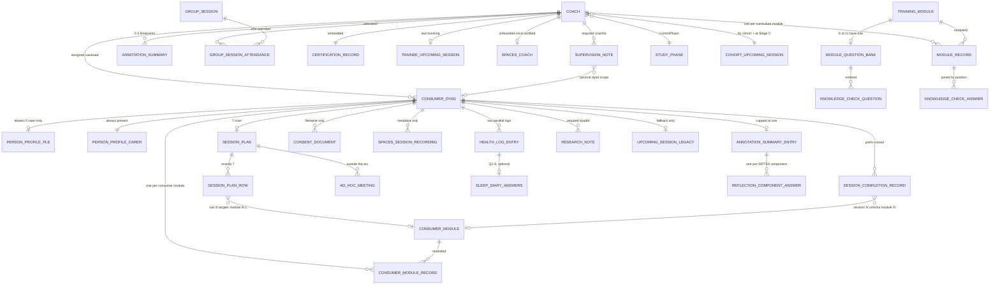

# Data model

The reference for an engineer designing the real schema behind the Care2Sleep
Research Dashboard.

Everything here was verified against the source in `app/src/data/` — six files,
~4,550 lines. Where this document states a count, a caller, or an invariant
violation, it was checked by reading the code or by executing the fixtures, not
inferred. Claims that could not be verified are marked as open questions rather
than filled in.

**What the data layer is.** Everything is in memory. There is no persistence, no
network call, and no `localStorage` in `app/src/data/`. Two seed modules export
fixture arrays; `research-store.tsx` copies them into React state at boot; pages
read the copies through `useResearch()`. Reloading the page restores the
fixtures exactly.

| File | Lines | What it holds |
|---|---:|---|
| `research.ts` | 1,764 | The COACH training pathway: coaches, modules, assessment content, certification |
| `spaces.ts` | 1,600 | SPACES delivery: consumers, sessions, plans, sleep data, notes |
| `research-store.tsx` | 860 | All mutable state and every write action |
| `trainingPathwayV2.ts` | 231 | The 11-module coach curriculum (reference data) |
| `format.ts` | 69 | The clock (`TODAY`) and display formatters |
| `research-context.ts` | 26 | `useResearch()` accessor |

The two domains join on one key: `Coach.id`, referenced by
`SpacesCoach.coachId` and `ConsumerDyad.coachId`.

---

## 1. Read this first: the three things that get modelled wrong

These are the failure modes this codebase has actually shipped. Everything else
in the document is detail.

### 1.1 Session and module numbering is offset three different ways

One module carries three different numbers, all correct in their own context.

| Concept | Internal (stored) | Displayed |
|---|---|---|
| Session key 1 | `1` | `"Planning"` — never a number |
| Session key N (2–7) | `N` | `"Session N−1"` |
| Module index N | `N` | `"Module N+1"` |

And the relationships between them:

- Module index `N` is **unlocked by** internal session `N`.
- Module index `N` is **reviewed by** internal session `N+1`.
- Module index `0` is the always-unlocked "Getting started" pre-module.

**Rules.** Internal numbers key all stored data and must never reach UI copy.
Route every displayed session number through `sessionRowLabel(n)` (safe for all
inputs) or `displaySessionNumber(n)` (only when the input is provably 2–7).
Every "N of 6" progress figure uses `catchupSessionsCompleted()` against
`SPACES_CATCHUP_COUNT` (6) — never `SPACES_SESSIONS.length` (7), which counts
the unnumbered Planning session and once produced a consumer reading
"1 of 7 sessions completed" beside "Next Session: Session 1".

### 1.2 Two lifecycle axes on `Coach`, and two more on `SpacesCoach`

`Coach.status` (`enrolled | active | withdrawn | completed`) is the **study**
lifecycle. `Coach.inviteStatus` (`pending | active`) is **platform-invite
acceptance**. They are independent, and both label a state "Active".

**Every roster "Status" column and its matching KPI tile renders
`inviteStatus`.** `status` is not shown there. Counting one field under a label
that displays the other is a defect this project has shipped twice — most
visibly as an "Active trainees: 6" tile above a table of five `Active` chips.

`SpacesCoach` repeats the pattern with `invitationStatus` and `joinedStatus`.
Neither is displayed anywhere in this build, so onboarding a coach records a
state nothing ever shows.

### 1.3 The seed/store shadow boundary

Three store slices hold live state alongside a seed field describing the same
thing. Two are clean; one is not.

| Seed field | Live store slice | Status |
|---|---|---|
| `ConsumerDyad.sessionsCompleted` | `sessionCompletion[dyadId]` | Seed field goes **stale at boot**. Nothing reads it. Verified. |
| `ConsumerDyad.sessionPlan` | `sessionPlans[dyadId]` | Same. Nothing reads it. Verified. |
| `Coach.currentPhase` | `phaseCompletion[coachId]` | **Messy.** `currentPhase` is still read live for stage labels and gating, while `phaseCompletion` carries the ticks. `togglePhase` never writes back, so the two can disagree — a coach can have Stage H ticked while `currentPhase` still says Stage O. |

For a real backend, all three should be first-class tables
(`coach_stage_completion`, `session_completion`, `session_plan_row`) and the
duplicated fields on `Coach` / `ConsumerDyad` should be dropped or made strictly
derived views. Keeping both is the two-fields-one-fact pattern that produced
1.1 and 1.2.

### 1.4 The clock

`TODAY = '2026-07-22'` (`format.ts`) is a frozen constant, not `new Date()`. It
drives the Upcoming/Scheduled split, "sessions this week", pending-invite
ageing, the "certified this period" window, the guard blocking completion of a
future session, and the timestamp on every store write.

The whole fixture set is authored around it, so replacing it with a real clock
requires re-dating the fixtures in the same change. Dates are bare
`YYYY-MM-DD` strings compared with `>` / `localeCompare`; times are 24-hour
`"HH:MM"` — **except** the Consensus Sleep Diary, which stores free-form
`"10:00 pm"` strings parsed by `parseTimeToMinutes`. Two time formats coexist
in one schema.

---

## 2. Entity relationships

Live cardinality in the fixtures: **9 coaches** (3 with `outcome: 'pass'`),
**2 `SpacesCoach` rows**, **5 dyads** (4 on the roster, 1 flagged
`omitFromConsumerRoster`), **3 supervision notes**, **0 research notes**,
**11 curriculum modules**, **7 consumer modules**, **8 question banks**,
**4 group sessions**, **1 cohort** ("Cohort 1").

### Notes on the diagram

- `SLEEP_DIARY_COMPUTED` (Q10–13) is deliberately absent — it is never stored.
  See §5.
- `SESSION_RECORDING` (the COACH-phase one) is absent because it is derived on
  demand and never persisted. It is a different type from
  `SPACES_SESSION_RECORDING`, which *is* stored on the dyad.
- `SUPERVISION_NOTE` and `RESEARCH_NOTE` are deliberately separate types, not
  one type with a nullable FK. See §3.2.

---

## 3. Types

Legend: **S** = stored, **D** = derived at render (never persisted),
**Seed-only** = present on the object but stale after boot.

### 3.1 `research.ts` — the COACH pathway

#### Enums and reference tables

| Type | Values | Notes |
|---|---|---|
| `CoachStatus` | `enrolled \| active \| withdrawn \| completed` | Study lifecycle. **Not** what rosters display. |
| `InviteStatus` | `pending \| active` | Platform-invite acceptance. **This is what rosters display.** `pending` is currently terminal — see §7. |
| `CertificationOutcome` | `not-yet-assessed \| pass \| remediation-required` | `pass` is the only thing making a coach eligible for SPACES. |
| `ModuleRecordStatus` | `not-started \| in-progress \| completed` | Identical union to two others — see §8. |

`STUDY_PHASES` — the 8 COACH lifecycle phases. Only 5 carry a `stageCode`:

| # | Name | Stage | Short label |
|---|---|---|---|
| 1 | Recruitment | — | Recruitment |
| 2 | Enrolment and platform access | — | Enrolment and platform access |
| 3 | Content learning | **C** | Learning |
| 4 | Guided group practice | **O** | Group Practice |
| 5 | Placement 1 | **A** | Placement 1 |
| 6 | Community of practice | **CP** | Community Practice |
| 7 | Placement 2 and certification | **H** | Waiting final assessment |
| 8 | Entry into SPACES delivery | — | Entry into SPACES delivery |

Phases 1, 2 and 8 bracket the pathway rather than forming part of it, which is
why they carry no `stageCode` and are excluded from the Stage Management
pipeline.

#### `Coach` — the central record

One aged care worker on the COACH pathway. The same record serves a trainee
mid-training and a certified coach delivering SPACES; certification changes
fields, not the type. All fields **S**.

| Field | Type | Meaning |
|---|---|---|
| `id` | `string` | PK. Join key for `SpacesCoach.coachId` and `ConsumerDyad.coachId`. |
| `participantId` | `string` | Study identifier, `C2S-C-NNN`, unique. Minted by `nextParticipantId()`. |
| `fullName`, `initials` | `string` | `initials` is derived once at creation, then stored. |
| `email`, `phone` | `string` | The only contact fields with a write path. |
| `employer` | `string` | Aged care partner organisation. |
| `roleAtEmployer` | `string` | Job title at that organisation. |
| `yearsInAgedCare` | `number` | Sector experience at recruitment. |
| `cohort` | `string` | Training cohort. **Not an entity** — a plain string matched by equality against `CohortUpcomingSession.cohort`. No longer surfaced in the UI but still the join for cohort-wide group-practice scheduling. |
| `enrolmentDate` | `string` | ISO date Phase 2 completed. |
| `status` | `CoachStatus` | Study lifecycle. |
| `inviteStatus` | `InviteStatus` | Invite acceptance. |
| `currentPhase` | `number` 1–8 | Indexes `STUDY_PHASES`. **Read-only** — no action writes it. |
| `withdrawalNote` | `string?` | Set by `withdrawCoach`. Withdrawal is soft. |
| `lastActive` | `string?` | **Absent means never signed in**, rendered "Never". Do not backfill. |
| `moduleRecords` | `ModuleRecord[]` | Exactly one per curriculum module, always. |
| `demoVideoNotes` | `string?` | Assessor's notes on the demonstration-video task. Populated on most trainees, **rendered nowhere**. |
| `annotationSummaries` | `AnnotationSummary[]` | 0–3, gated by stage. |
| `groupSessionAttendance` | `GroupSessionAttendance[]` | Stage O attendance. |
| `certification` | `CertificationRecord` | Embedded. |
| `notificationPreferences` | `NotificationPreferences?` | Render-time defaults when absent. |
| `upcomingSession` | `TraineeUpcomingSession?` | Individual booking. Stage O bookings are cohort-wide and live elsewhere. |

Every date on a coach must be `<= TODAY`, except `upcomingSession.date`.

#### `ModuleRecord` — one coach × one module

All **S**. The optional fields are **not independent of `status`**:

| `status` | `completedDate` | `slidesCompleted` | answers |
|---|---|---|---|
| `completed` | required | **must be absent** | may be present |
| `in-progress` | absent | required | may be present |
| `not-started` | absent | absent | absent |

A completed record carrying a partial slide count reads as a module that is
both finished and part-done on the same screen. `fillRecordsComplete()` strips
`slidesCompleted` on promotion for exactly this reason.

Other fields: `moduleId` (FK to `TrainingModuleV2.id`), `scenarioResponse`
(written answer to the module's prompt), `knowledgeCheckAnswers`
(`{ selectedIndex }[]`, **joined to the question bank by array position, not by
id**), `feedbackRating` (0–5) and `feedbackComment` — the last two independent
of each other, and **absent means "not given", not zero**.

#### `AnnotationSummary` — reflection timepoints 1–3

The study defines four reflection timepoints. This type covers the three that
happen during training. The fourth (post-practice) is a structurally different
type in `spaces.ts` — see §8.

| Field | Type | Notes |
|---|---|---|
| `timepoint` | `baseline \| midline \| endline` | **S** |
| `approvedDate` | `string` | **S** Date the coach approved the AI summary for storage. |
| `shared` | `boolean` | **S** The coach's decision, per timepoint. |
| `summary` | `string?` | **S** Present **only** when `shared`. An unshared reflection genuinely has no readable content on the researcher's side — that is the study's access rule, not a data gap. |

The endline summary is the one the expert assessor sees for certification.

#### `CertificationRecord`

| Field | Type | Notes |
|---|---|---|
| `outcome` | `CertificationOutcome` | **S** |
| `assessedDate` | `string?` | **S** Present iff assessed. Must not be in the future. |
| `certificateGenerated` | `boolean` | **S — but never written.** `false` on every record in existence. |
| `certificateDate` | `string?` | **S — but never written.** |
| `note` | `string?` | **S** Shown alongside a remediation outcome. |

The last two are **modelled but unimplemented**. Nothing reads or sets them,
and the "Download" control on a coach profile is inert because no certificate
artifact exists anywhere in the model. They are kept because certificate
generation is a real study requirement and these are the intended hooks — read
them as specification, not as a live workflow flag. An engineer will otherwise
find `certificateGenerated` and assume the flow works.

#### Scheduling: three shapes for one concept

| Type | Scope | Where stored |
|---|---|---|
| `TraineeUpcomingSession` | One trainee (Placement 1 / Placement 2 / supervision) | `Coach.upcomingSession` |
| `CohortUpcomingSession` | A whole cohort (Stage O group practice) | Module-level `upcomingGroupSessions` |
| `UpcomingSession` (`spaces.ts`) | One dyad, legacy | `ConsumerDyad.upcomingSession` |

Stage O is scheduled per **cohort** — one meeting many trainees attend — so it
cannot live on a coach record without being duplicated N times. Anything asking
"what is booked for this trainee" must consult both, which is what
`stageZoomSession()` exists to do.

All three carry `meetingId` and `zoomLink`. **The Zoom credentials are
fabricated but render as real, clickable `https://zoom.us/j/…` anchors.**
Clicking one reaches a stranger's meeting or a 404. They are not inert
placeholders.

#### `SessionRecording` — **derived, not stored**

Metadata about a recorded COACH-phase session. **D** — produced on demand by
`sessionRecordingsFor()`, never seeded. There is no media anywhere in this data
model: no file, no URL, no storage. The shape exists because session recordings
are a stated research requirement; the artifact does not.

Currently **zero callers** — the Session Recordings tab was not shipped. The
derivation is complete and reviewed (including a `historicalOr()` guard keeping
a certified coach's recording dates behind their own assessment), so it is worth
knowing it exists rather than rebuilding it.

Access per study rules: research team and expert assessor only, never the coach.

#### `researcher` — the signed-in user

A hardcoded object literal, not an interface: `fullName`, `initials`, `role`,
`organisation`, `email`, `phone`, `notificationPreferences`. Currently
Claire Donnelly, Monash University.

**This is the identity boundary.** There is no authentication anywhere in the
package. Note specifically that `addResearchNote` and `addSupervisionNote`
record **no author id** — a real study audit trail needs one, and the field does
not exist on either note type.

### 3.2 `spaces.ts` — SPACES delivery

#### `ConsumerDyad` — the consumer record

The study models a consumer as a **dyad**: a Person with Lived Experience (the
member with dementia) and their carer.

| Field | Type | Notes |
|---|---|---|
| `id` | `string` | PK. |
| `coachId` | `string?` | **S** FK to `Coach.id`. Absent until assigned — consumers are enrolled before assignment. |
| `coachAssignedDate` | `string?` | **S** Present iff `coachId`. **`transferDyad` does not update it**, so a transferred dyad keeps its original assignment date while several surfaces render it as "coach assigned on". |
| `patient` | `PersonProfile?` | **S** The PLE. **Absent for a carer-only consumer** — every read must be guarded. Named `patient` for historical reasons; the term used everywhere else, including all UI copy, is **PLE**. |
| `carer` | `PersonProfile` | **S** Always present. |
| `sleepGoals`, `caregivingContext` | `string` | **S** Intake fields. |
| `notes` | `string?` | **S** "Additional notes", owned by the research coordinator. |
| `coachNotes` | `string?` | **S** The **coach's** notes. Deliberately separate from `notes` — a coach editing their notes must never overwrite intake notes. |
| `sessionsCompleted` | `SessionCompletionRecord[]` | **Seed-only.** Read `sessionCompletion[dyadId]`. |
| `sessionPlan` | `SessionPlan?` | **Seed-only.** Read `sessionPlans[dyadId]`. |
| `annotationSummaries` | `AnnotationSummaryEntry[]` | **S** Most-recent-first, capped at one by the write path. |
| `patientLog`, `carerLog` | `HealthLogEntry[]` | **S** Two parallel nightly logs. |
| `consentDocuments` | `ConsentDocument[]` | **S** Filenames only. |
| `moduleEngagement` | `ConsumerModuleRecord[]` | **S** Exactly one per consumer module. |
| `sessionRecordings` | `SpacesSessionRecording[]` | **S** Metadata only, no media. |
| `upcomingSession` | `UpcomingSession?` | **S, legacy.** Read only via `nextUpcomingSessionEntry()`. |
| `notificationPreferences` | `NotificationPreferences?` | **S** The carer holds the account. |
| `optedOut` | `{reason, date}?` | **S** One-way; there is no un-opt-out. |
| `omitFromConsumerRoster` | `boolean?` | **S** Hides the dyad from the Consumer Management roster **only**. It stays fully real everywhere else. A visibility flag, not an archive state. See §9 for the KPI drift this causes. |

Nothing is ever deleted. Withdrawal, opt-out and coach transfer are all soft.

#### `PersonProfile`

`name`, `age`, `relationship?` (**carer only** — this is what distinguishes the
two members), `background`, `email?`, `phone?`. Contact details are realistically
only populated for the carer, who actually operates the consumer-facing portal.

#### Sessions and plans

`SPACES_SESSIONS` — the fixed 7-session arc. Internal key 1 is "Planning" (the
coach and consumer's first meeting, where they agree the module target dates);
keys 2–7 are the catch-ups the consumer reads as Sessions 1–6.

`SessionCompletionRecord` — `session`, `completedDate`, `completedTime`. **S**.
Expected to be prefix-closed; every "next session" helper assumes it.

`SessionPlanRow` — **S**:

| Field | Notes |
|---|---|
| `session` | Internal 1–7. |
| `date`, `time` | Undefined until planned. |
| `moduleTargetDate` | Sessions 2–7 only. The date the consumer should have finished the module this catch-up reviews. **Must fall strictly before the row's own `date`** — the consumer completes the module, then the coach catches up on it. This is a *target the coach communicates*, **not** the unlock trigger. |
| `rescheduled` | Flagged when a date changes after being set. **Two writers disagree about when to set it** — see §9. |
| `meetingId`, `zoomLink` | Minted when the row is first dated. |

`SessionPlan` = `{ sessions: SessionPlanRow[]; adHocMeetings: AdHocMeeting[] }`.
`AdHocMeeting` is a deliberately separate concept from the fixed 7-session arc.

#### Consumer content

`ConsumerModule` — `id`, `title`, `slideCount` (uniform 6).
`CONSUMER_MODULES` has **7 entries in unlock order** — index is meaningful, so
never reorder or splice. Index 0 (`getting-started`) is a pre-module, always
available from enrolment. Indices 1–6 are the named modules.

`ConsumerModuleRecord` — `moduleId`, `status`, `lastActivityDate?`,
`slidesCompleted?`. All **S**. Three rules a fixture or backend must respect,
each of them something a reader would otherwise see contradicted on screen:

1. A module with **any** progress must be unlocked.
2. **No plan, no progress.** Module content only opens once a session plan
   exists. By extension: no coach → no plan → no progress.
3. **"In progress" is only possible before the module's own catch-up.** Once
   that session has been held the module is complete or it was left incomplete
   — never still in progress.

#### Sleep data

`HealthLogEntry` — one person, one night. **This array is the Fitbit
integration boundary**: it is where a nightly device sync would deposit
readings. There is no Fitbit client anywhere in the package.

Two independent sources live on one entry and must not be conflated:

- **Device readings** (`remPercent`, `deepPercent`, `lightPercent`,
  `durationMin`, `disturbances`) exist **only** when `synced` is true. A missed
  sync means no reading at all, not a zero.
- **The carer's manual entries** (`diaryEntry` free text, `diary` structured
  answers) are **independent of `synced`** — a diary can be filled in on a night
  the device failed, and missing on a night it worked.

> **Defect found while verifying this document.** The three sleep-stage
> percentages are documented as "% of total sleep time" summing to ~100. In the
> fixtures they sum to **103–124** on every synced night, with `remPercent`
> values as high as 74 (REM is physiologically ~20–25%). Example, dyad-011
> 2026-07-05: `rem 72, deep 8, light 30`. This is currently **latent** — all
> three render as independent columns and are never summed or stacked — but
> either the field semantics or the seed values are wrong. Resolve before
> building any chart that treats them as shares of a whole. See §9.

`SleepDiaryAnswers` — the Consensus Sleep Diary's **9 directly-answered**
questions (Q1–9). This is a standard published instrument; the numbering and
formulas are its, not this project's. Times are free-form `"h:mm am/pm"`
strings, not the 24-hour format used everywhere else.

`SleepDiaryComputed` — questions **Q10–13**. **D — always derived at render,
never stored.** This is a real rule, not an implementation detail: persisting
them would let a stored total drift from the answers it was computed from, and
the entire point of these four is that they are a function of the other nine.

#### Reflection, consent, notes

`AnnotationSummaryEntry` — the coach's **post-practice** reflection for one
consumer, the fourth timepoint. Broken into one `ReflectionComponentAnswer` per
SIPTEA component instead of a single free-text body. Array-typed but **capped at
one** by the write path, which replaces rather than appends.

`ReflectionComponentAnswer.label` **must** be one of the 6 SIPTEA component
names spelled exactly as the reflection wizard writes them (Shared
understanding, Implementation intent, Problem identification, Tailoring, Emotion
navigation, Action and goals). Every display surface renders the stored string
verbatim, so a typo appears as a seventh component.

`ConsentDocument` — `id`, `filename`, `uploadedDate`. **Filename only; no file
is stored anywhere.** The upload/remove UI was dropped, so this is display-only
evidence read for its date. This is the document-storage integration boundary.

`SupervisionNote` vs `ResearchNote` — deliberately **two narrow types, not one
loose one**:

| | `SupervisionNote` | `ResearchNote` |
|---|---|---|
| `coachId` | **required** | absent |
| `dyadId` | optional (narrows to one consumer) | **required** |

A researcher needs to write about a consumer regardless of whether a coach has
been assigned, which a `SupervisionNote` cannot express. Making `coachId`
optional instead would force every existing reader to handle an authorless note
it never receives.

Both store `attachments` as **filenames only** — the `File` object is discarded.
The UI then lists the filename, which reads exactly like a successful upload
that never happened. **Neither records an author.**

### 3.3 `trainingPathwayV2.ts` — the coach curriculum

`PATHWAY_MODULES_V2` — **11 modules**, 4 Foundational + 7 Sleep. This is the
denominator for every "modules completed" figure the researcher sees. Derive
counts from `.length`, never a literal.

`TrainingModuleV2` carries `status` and `progress` fields that are **coach-portal
demo state**. The Research Dashboard ignores both entirely and reads
`Coach.moduleRecords` instead. Do not surface them on a researcher screen —
they describe nobody in particular.

**Ids are frozen and no longer describe their own titles.** `portal-orientation`
is titled "Know the project, know your client"; `siptea-framework-v2` is
"Onboarding and getting set up". The drift is deliberate — titles were revised to
match the study's curriculum document, ids were not. **When joining content to a
module, the id is authoritative and the title is display text.**

`MODULE_GROUPS` lists modules per tier and **must preserve the flat array's
relative order**, because lock state is computed from a module's index in
`PATHWAY_MODULES_V2`.

---

## 4. Store actions

`ResearchStore` (`research-store.tsx`) is the whole mutable surface. State
slices: `coaches`, `searchQuery`, `phaseCompletion`, `phaseCompletionDates`,
`spacesCoaches`, `consumerDyads`, `supervisionNotes`, `researchNotes`,
`manualRecordings`, `sessionCompletion`, `sessionPlans`, `manualModuleUnlocks`,
`researcherProfile`.

Caller columns below were established by grep across `src/`, excluding
`data/` and excluding comment-only matches.

### Wired — reachable from a real screen

| Action | Mutates | Caller |
|---|---|---|
| `setSearchQuery(q)` | `searchQuery` | `RosterPage` only. Consumer and Coach rosters keep their own local state, so a term typed on Trainee Management survives navigation while the others do not. |
| `addCoachTrainee(input) → id` | Appends `coaches`; seeds `phaseCompletion[id]` | `AddCoachTraineeModal` |
| `withdrawCoach(coachId)` | `status='withdrawn'` + `withdrawalNote` | `CoachProfilePage`, `SpacesCoachProfilePage` |
| `updateContact(coachId, {email, phone})` | Those two fields | `CoachProfilePage`, `SpacesCoachProfilePage` |
| `togglePhase(coachId, phase)` | `phaseCompletion`; stamps `phaseCompletionDates[…]=TODAY` on tick, **clears it on revert** | `CoachProfilePage` |
| `recordCertificationOutcome(coachId, outcome)` | `certification.outcome`, `.assessedDate=TODAY`, `.note` | `CoachProfilePage` |
| `inviteCoach(coachId)` | Appends `spacesCoaches` (invited/not-joined). Idempotent by `coachId` | `OnboardCoachDialog` |
| `updateDyadPerson(dyadId, who, patch)` | One dyad member | `ConsumerDetailPage` |
| `updateDyadCoachNotes(dyadId, notes)` | `coachNotes` **only**, never `notes` | `SpacesCoachProfilePage` |
| `transferDyad(dyadId, newCoachId)` | `coachId` **only** — not `coachAssignedDate` | `SpacesCoachProfilePage` (serves both assign and transfer) |
| `addSupervisionNote(coachId, note)` | Prepends `supervisionNotes` | `SpacesCoachProfilePage` |
| `addResearchNote(dyadId, note)` | Prepends `researchNotes` | `ConsumerDetailPage` |
| `updateResearcherContact(patch)` | `researcherProfile` | `ResearchAccountPage` |
| `updateResearcherNotificationPreferences(prefs)` | `researcherProfile.notificationPreferences` | `ResearchAccountPage` |
| `updateCoachNotificationPreferences(coachId, prefs)` | `Coach.notificationPreferences` | `SpacesCoachProfilePage` |
| `updateDyadNotificationPreferences(dyadId, prefs)` | Dyad field | `ConsumerDetailPage` |
| `setDyadOptOut(dyadId, reason)` | `optedOut = {reason, date: TODAY}` | `ConsumerDetailPage` |

### Reachable only from components that are never mounted

`grep` finds callers for these, which is why they are easy to mistake for live.
Their only callers are `PlanSessionsModal.tsx` and `EditSessionPlanModal.tsx`,
neither of which has a mount site anywhere in the package.

| Action | Mutates |
|---|---|
| `toggleSession(dyadId, session)` | `sessionCompletion[dyadId]`. On add writes `completedDate: TODAY` but `completedTime` from the **real machine clock** — see §9. |
| `bulkSetSessionPlan(dyadId, rows)` | All 7 rows; mints Zoom credentials per dated row; sets `rescheduled` when a date actually changed. |

Session planning is the **coach's** workflow, and that portal is not in this
package. A researcher reads a plan read-only through `SessionsPlanOverview` and
cannot create or amend one. That is by requirement, not omission.

### No caller at all

| Action | Was for |
|---|---|
| `enrollConsumer(input) → id` | **The gap that matters most.** There is no working way to add a consumer in this build. This is the shape a REDCap importer should call, once per synced record. |
| `addConsumer(coachId, input)` | Creating a consumer already assigned to a coach. |
| `updateDyadOverview(dyadId, patch)` | Editable sleep-goals / caregiving / intake-notes fields. |
| `updateSessionPlanRow(dyadId, session, patch)` | Per-row plan edits. Its `rescheduled` handling contradicts `bulkSetSessionPlan`'s — see §9. |
| `addConsentDocument` / `removeConsentDocument` | Consent forms are no longer stored on the platform. |
| `addManualRecording(coachId, rec)` | Recording upload. **Nothing reads `manualRecordings` either.** |

**11 of 30 actions are unreachable.** The presence of an action does not mean
the feature exists. Each encodes a real requirement, so deleting one is a
product call rather than cleanup.

### Two absolute properties of the write surface

**Nothing is ever deleted.** Withdrawal, opt-out and transfer are all soft.
There is no un-invite, no un-enrol, no delete-dyad, no delete-note, no
un-unlock.

**These fields have no write path at all and are read-only forever:** all
`Coach.moduleRecords` (every scrap of learning progress), `groupSessionAttendance`,
`certification.certificateGenerated`/`certificateDate`,
`ConsumerDyad.moduleEngagement`, `patientLog`/`carerLog`, `consentDocuments`,
`sessionRecordings`, `coachAssignedDate`, `lastActive`, and `currentPhase`.

Ids are minted from `Date.now()` and can collide within a millisecond. Fine at
prototype scale, not a pattern to carry forward — let a server assign ids.

---

## 5. Derived helpers and the single-source-of-truth rule

**This project's most repeated defect is two surfaces reading two different
fields for the same fact.** The table below is prescriptive: for each fact
rendered on more than one screen, use the named function and nothing else.
Hand-rolling any of these is how the two surfaces start disagreeing.

| Fact | Use exactly this | Never |
|---|---|---|
| The "Current Stage" string | `stageLabel(n)` (`research.ts`) | Building `"Stage C: …"` inline. The separator is a colon and the word "Phase" must not appear for a lettered stage. |
| Short stage identifier | `stageShortName(n)` | — |
| Is a session booked for this trainee, and for which stage | `stageZoomSession(coach)` | Reading `coach.upcomingSession` and `upcomingGroupSessions` separately. It merges both and gates the cohort session on `currentPhase === 4`. |
| Next participant ID | `nextParticipantId(coaches)` | A second copy of the `C2S-C-NNN` formula. It is deliberately shared between the wizard's live preview and the store's write, so the ID shown before submitting is the ID granted. |
| Any displayed session number | `sessionRowLabel(n)` | `displaySessionNumber(n)` when the input could be 1 (yields "Session 0"), and raw internal numbers always. |
| "N of 6" sessions completed | `catchupSessionsCompleted(completed)` vs `SPACES_CATCHUP_COUNT` | `sessionsCompleted.length` or `SPACES_SESSIONS.length`. |
| Which session is next (number **and** date together) | `nextUpcomingSessionEntry(plan, completed, legacy)` | Resolving number and date separately. `nextUpcomingSessionNumber` delegates to this one on purpose so they cannot come from two resolutions. |
| Does this consumer have a plan | `isPlanSet(plan)` | Counting dated rows inline. Four surfaces read this one predicate — the "Session Plan" chip, the "no sessions planned" KPI, the module-content gate, and the no-plan notification — which is why they cannot disagree. |
| Is a module unlocked | `moduleUnlockState(index, completed, manualUnlocks)` | Any inline comparison. Mind the offsets in §1.1. |
| Generating plan dates | `generatePlanRows(...)` | Per-row date entry. This function is what guarantees `moduleTargetDate < date` **by construction**; restoring per-row editing gives that up and needs its own validation. |
| Sleep diary Q10–13 | `computeSleepDiary(answers)` at render | Storing the results. |
| Reflection share state | `latestAnnotationState(dyad)` | Reading `annotationSummaries[0].shared` directly — it must distinguish `not-yet` (none written) from `not-shared` (written but withheld). |
| Fitbit / diary gap alerts | `dyadHealthAlerts(dyad)` | Duplicating gap detection. **But see the warning below.** |

### Two structural problems in this layer

**1. The gap rule lives in a page component.** `dyadHealthAlerts()` and
`hasRecentGap()` are exported from `pages/research/ConsumerDetailPage.tsx` and
imported by `components/research/ResearchNotificationHub.tsx` — the one
component→page dependency in the package. Sharing one definition is correct;
its location is not. Move both to `data/spaces.ts`.

**Worse, the implementation does not match the rule it claims.** It is
documented as ">48 hours without data" but implements
`log.slice(-2).every(failing)` — the last two **array entries**, with no
reference to their dates or to today. Two consequences:

- If a log simply stops (device returned, participant withdrew), the last two
  entries may both be `synced: true` and **no alert fires** — exactly the case
  the check exists for.
- It cannot distinguish a gap two days ago from one two months ago.

Re-implement as a real date difference. Do not port it as written.

**2. Study protocol constants are scattered across component files.** Each is
named and commented, but they encode study rules, not UI:

| Constant | Value | Location |
|---|---|---|
| `PENDING_INVITE_ALERT_DAYS` | 21 | `ResearchNotificationHub.tsx:60` |
| `CERTIFIED_WINDOW_DAYS` | 60 | `RosterPage.tsx:89` |
| `GROUP_PHASE` | 4 | `ResearchHomePage.tsx:86` |
| `INDIVIDUAL_SESSION_PHASES` | `[5, 7, 8]` | `ResearchHomePage.tsx:87` |
| `WEEK_DAYS` | 7 | `ResearchHomePage.tsx:94` |
| `NOMINAL_SLIDE_COUNT` | 6 | `CoachProfilePage.tsx:161` |
| **`GRADUATED_PHASE`** | **8** | **`RosterPage.tsx:72` *and* `ResearchHomePage.tsx:91`** |

`GRADUATED_PHASE` is the live risk: one study rule behind two constants, feeding
a KPI tile and the roster beneath it. A change to one alone makes the tile
contradict the table. Consolidate into one `config/protocol.ts`.

`NOMINAL_SLIDE_COUNT = 6` deserves separate mention: it is a **guessed
denominator** inherited from a superseded dataset. The real curriculum has no
per-module slide count at all, so every in-progress module's percentage is an
estimate against a number that is not a fact about any module. 100% and 0% are
exact; everything between is fabricated precision.

---

## 6. Invariants

Each is stated as an assertable rule with the reason it exists. Rules marked
**VIOLATED** were checked by executing the fixtures — see §7 for which record.

### COACH pathway

| # | Rule | Why |
|---|---|---|
| 1 | `inviteStatus === 'pending'` ⇒ every module `not-started` **and** `lastActive` absent | A trainee who never signed in cannot have progress. |
| 2 | `currentPhase >= 4` ⇒ every module `completed` | Stage O is only reachable after Content learning. Enforced structurally by `fillRecordsComplete()`. |
| 3 | `currentPhase < 4` ⇒ no attended group sessions | A Stage C trainee cannot have attended Stage O practice. |
| 4 | Annotation timepoints match the stage (C → none; O → baseline, then midline; H+ → all three), dates non-decreasing | A reflection out of sequence misrepresents the pathway. |
| 5 | `outcome !== 'not-yet-assessed'` ⇒ `assessedDate` present **and `<= TODAY`** | **VIOLATED.** |
| 6 | `outcome === 'pass'` ⇒ `currentPhase === 8` **and** `status === 'completed'` | Certification is awarded on passing Placement 2. |
| 7 | Every coach date `<= TODAY`, except `upcomingSession.date` | **VIOLATED.** |
| 8 | `participantId` unique and matching `/^C2S-C-\d{3}$/` | Verified true. |
| 9 | `moduleRecords` covers exactly `PATHWAY_MODULES_V2` — no extras, no duplicates | Verified true (9/9 coaches × 11 records). |
| 10 | Status/field consistency per the `ModuleRecord` table in §3.1 | A completed module showing partial slides contradicts itself. |
| 11 | `knowledgeCheckAnswers.length === getQuestionBank(moduleId)?.knowledgeCheck.length` when both exist | The join is **positional**; a length mismatch silently mis-scores. |
| 12 | `upcomingSession.phase`, when set, ∈ {5, 7}; a cohort's Stage O session applies only to coaches with `currentPhase === 4 && cohort === session.cohort` | Prevents a Stage C trainee inheriting their cohort's booking. |
| 13 | Only 8 of 11 modules have a question bank; the other 3 must score **null, never zero** | A trainee otherwise looks like they failed something never asked. |

### SPACES delivery

| # | Rule | Why |
|---|---|---|
| 14 | `SpacesCoach.coachId` resolves to a coach with `outcome === 'pass'` | Only certified coaches deliver. |
| 15 | `invitedDate <= joinedDate`, both `>=` that coach's `assessedDate` | **VIOLATED.** |
| 16 | `ConsumerDyad.coachId` resolves to a `Coach` **and** to a `SpacesCoach` row | **VIOLATED — and genuinely undecided.** See §9. |
| 17 | `coachAssignedDate` present ⇔ `coachId` present, and `<= TODAY` | Verified true. |
| 18 | `sessionsCompleted` unique per `session`, each ∈ [1,7], each `completedDate <= TODAY` | **VIOLATED.** |
| 19 | Completion is prefix-closed | Every "next session" helper assumes it. Verified true. |
| 20 | `completedDate` non-decreasing in `session` | Sessions run in order. |
| 21 | `catchupSessionsCompleted(...) <= SPACES_CATCHUP_COUNT` (6) | Verified true. |
| 22 | `moduleEngagement` covers exactly the 7 `CONSUMER_MODULES` | Verified true. |
| 23 | Module index N `in-progress` ⇒ internal session N+1 **not** completed | "In progress" after its own catch-up is not a real state. Enforced in seed *and* guarded at both render sites. |
| 24 | `status !== 'not-started'` ⇒ that module is unlocked | Progress on a locked module is impossible. |
| 25 | `!isPlanSet(plan)` ⇒ every module record is `not-started` | Content is gated on a plan; no coach → no plan → no progress. |
| 26 | `lastActivityDate <= TODAY`; `completed` ⇒ `slidesCompleted === slideCount` (6) | **VIOLATED** (dates). |
| 27 | Plan row N ≥ 2: `moduleTargetDate < date` strictly. Row 1 carries none | True by construction via `generatePlanRows()`. Verified true. |
| 28 | A dated plan row also carries `meetingId`/`zoomLink` | **VIOLATED** — see §9. |
| 29 | `isPlanSet(plan)` ⇒ internal session 1 is complete | Creating a plan and completing the Planning session happen together. |
| 30 | `annotationSummaries.length <= 1` per dyad | Enforced by the store, **not** by the type. |
| 31 | Every `ReflectionComponentAnswer.label` is one of the 6 SIPTEA names, exactly | A typo renders as a seventh component. |
| 32 | `patientLog` non-empty ⇒ `patient` present; logs date-ascending, unique dates, latest `<= TODAY` | Note the converse does **not** hold: a dyad can have a PLE and an empty log (nothing has started yet). |
| 33 | `synced === false` ⇒ all five Fitbit fields absent | A missed sync is no reading, not a zero. Verified true. |
| 34 | `remPercent + deepPercent + lightPercent ≈ 100` when synced | **VIOLATED throughout** — see §3.2 and §9. |
| 35 | `computeSleepDiary` output sane: `sleepOpportunityMin > 0`, `0 <= sleepEfficiencyPercent <= 100` | **Nothing asserts this.** A bad bedtime/out-of-bed pair silently yields negative sleep time. |
| 36 | `SupervisionNote.dyadId`, when set, belongs to a dyad currently assigned to `coachId` | A note under one coach about another's consumer reads as a data error. |
| 37 | Note and document ids unique within their arrays | — |

---

## 7. Seed fixtures — which states are deliberate

Fixtures are **curated, not arbitrary**. Each record demonstrates one UI state.
Deleting one removes a case from the demo.

### Coaches (9)

| Record | Stage | Demonstrates |
|---|---|---|
| **Helen Zhang** `C2S-C-010` | 8, certified | The actively-delivering coach. The **only** coach with a real caseload (3 dyads). Referenced widely — do not regress her to an earlier stage. |
| **Priya Raman** `C2S-C-014` | 3, **invite pending** | The unaccepted invite: zero modules, no `lastActive`, four of five profile tabs inert, persistent amber banner. |
| **Marcus Webb** `C2S-C-011` | 3 (Stage C) | Mid-Content-learning: 5 of 11 complete, 1 in progress. The only coach exercising partial module state. |
| **Aisha Mohamed** `C2S-C-012` | 4 (Stage O) | At group practice, all modules done, baseline + midline reflections. |
| **Daniel Osei** `C2S-C-013` | 4 (Stage O) | Second Stage O attendee. |
| **Noah Fenwick** `C2S-C-015` | 4 (Stage O) | Third Stage O attendee. **Three exist so the cohort's group session has enough attendees to exercise the schedule's "+N" name truncation.** |
| **Lauren Mitchell** `C2S-C-009` | 7 (Stage H) | Completed everything, awaiting final assessment — `not-yet-assessed` at Phase 7. |
| **Fatima Haidari** `C2S-C-020` | 8, certified | Onboarded into SPACES with **zero** consumers — the empty-caseload case. |
| **Mei-Ling Chen** `C2S-C-025` | 8, certified | **Certified but deliberately NOT in `spacesCoaches`.** This is what populates the "Waiting to be onboarded" tab and gives the Onboard flow a candidate. Onboarding her empties both. |

All 9 are in "Cohort 1". Three certified coaches (Helen, Fatima, Mei-Ling) have
`lastActive` absent and render "Never" despite `inviteStatus: 'active'`.

### Consumer dyads (5)

| Record | Demonstrates |
|---|---|
| **dyad-014** (Helen) | Assigned, nothing started. Every absence is correct: no plan, no reflection, no logs, no module progress. Flagged `omitFromConsumerRoster`. |
| **dyad-011** Bruce & Joan Whitfield (Helen) | The edge-case dyad: a device sync gap, one missing-diary night, and modules deliberately out of step with sessions. Carries a legacy `upcomingSession: 2`. |
| **dyad-012** Dorothy & Frank Kellerman (Mei-Ling) | Coach assigned, **no plan built** — the "plan sessions" entry case. Must keep no `upcomingSession`. |
| **dyad-013** (Helen) | The completed arc: all 7 sessions, all 7 modules, one shared reflection, 7 recordings. |
| **dyad-030** | Enrolled, **no coach assigned** — drives the "Not assigned" chip and the red notification. |

`spacesCoaches` holds exactly two rows (Helen with a caseload, Fatima without)
because those are the two states Coach Management must render.

`researchNotes` is intentionally empty so that surface starts at its empty
state.

---

## 8. Duplicated concepts to resolve before schema design

Structural typing means none of these error today, so they stay invisible until
someone changes one copy.

1. **`NotificationPreferences` is declared twice, identically** —
   `research.ts` and `spaces.ts`. The store imports the `research.ts` one and
   uses it for both coaches and dyads.
2. **Three identical status unions** — `ModuleRecordStatus`,
   `ConsumerModuleRecordStatus`, `TrainingModuleV2Status`.
3. **Three near-identical meeting shapes** — `TraineeUpcomingSession`,
   `CohortUpcomingSession`, `UpcomingSession`. Define one `Meeting` with a
   discriminator (cohort / individual / supervision) rather than three parallel
   interfaces.
4. **Two "session recording" types** — `SessionRecording` (coach,
   COACH-phase-scoped, **derived**) vs `SpacesSessionRecording` (dyad,
   SPACES-session-scoped, **stored**). Neither has media.
5. **Two "annotation summary" types for one study concept** —
   `AnnotationSummary` (3 training timepoints, free-text body) and
   `AnnotationSummaryEntry` (post-practice, structured per SIPTEA component).
   They do not reference each other; consolidating means reconciling a
   free-text field with a structured one.
6. **Two note types** — `SupervisionNote` / `ResearchNote`. This split is
   deliberate and documented; keep it.
7. **Two module curricula** — `PATHWAY_MODULES_V2` (11, coach) and
   `CONSUMER_MODULES` (7, consumer). Unrelated ids, different counts, both
   called "modules" in UI copy.
8. **New-dyad module seeding written inline twice** in `research-store.tsx`
   (`addConsumer` and `enrollConsumer`) instead of reusing `spaces.ts`'s
   `consumerModuleEngagement`, which is not exported. Three copies of one rule
   that must agree.

---

## 9. Open questions the schema must resolve

Ordered by how much they block a real build.

**1. How do consumers get created?** `enrollConsumer` has no caller and the
in-app wizard was removed; Consumer Management offers an inert "Sync with
REDCap" control instead. **There is currently no working way to add a
consumer.** `enrollConsumer` already builds a complete `ConsumerDyad` from a
plain input object and is the intended target for a REDCap importer, once per
synced record. Decide whether intake is REDCap-only or whether a platform-side
flow returns.

**2. May a consumer be assigned to a coach who has not been onboarded into
SPACES?** The fixtures do exactly this (dyad-012 → Mei-Ling Chen, who has no
`SpacesCoach` row). The consequence is live: Coach Management builds its roster
from `spacesCoaches` alone, so her caseload of one is **invisible**, and
onboarding her makes a consumer appear that was never assigned through the UI.
Either forbid it (making `coachId`'s referential target the SpacesCoach table)
or model "assigned before onboarding" as a real state. Do not inherit this from
fixture data.

**3. Should `recordCertificationOutcome` also advance `currentPhase` and set
`status: 'completed'`?** The fixtures pair a `pass` with both. The action sets
neither. Invariant 6 therefore holds in seed data but would break the first
time a researcher records a pass through the UI.

**4. Are certificate generation and recording upload in scope?**
`certificateGenerated` / `certificateDate` are declared and never written;
`sessionRecordingsFor()` is a complete derivation with no caller; there is no
media artifact anywhere. All three encode real study requirements. Confirm
scope before deleting or building.

**5. What do the sleep-stage percentages actually mean?** They are documented
as shares of total sleep time but sum to 103–124 in every synced fixture entry,
with REM as high as 74%. Latent today (rendered as independent columns) and
fatal to any stacked chart. Decide whether the fields are shares of a whole and
fix whichever side is wrong.

**6. Which clock stamps a write?** `toggleSession` writes `completedDate` from
the frozen `TODAY` but `completedTime` from the real machine clock, so one
record carries two notions of "now". Pick one server-side timestamp.

**7. When is a session "rescheduled"?** Two writers disagree.
`bulkSetSessionPlan` compares old and new dates, matching the contract.
`updateSessionPlanRow` sets the flag for **any** patch to an already-dated row,
so editing only `moduleTargetDate` falsely reports the session as moved. Latent
only because that action has no caller. Prefer deriving this from a change
history rather than storing a boolean two paths can disagree on.

**8. Who authored a note?** Neither `SupervisionNote` nor `ResearchNote` has an
author field, and there is no identity model to supply one. For a research
record this is a real gap.

**9. Does `transferDyad` need to update `coachAssignedDate`?** It currently
sets `coachId` only, so a transferred dyad shows its original assignment date
while several surfaces render it as "coach assigned on".

**10. Two dated plan rows carry no Zoom credentials.** All seven of dyad-013's
rows and dyad-011's Planning row are dated but have no `meetingId`/`zoomLink`,
contradicting invariant 28 as stated in the fixtures' own comments. Decide
whether credentials are required on a dated row (and backfill) or optional for
historical rows (and relax the rule).

**11. Which is authoritative for content joins, module id or title?** They have
drifted apart deliberately. The code treats the **id** as authoritative; a
migration must do the same, and three modules
(`building-blocks-good-sleep`, `retraining-brain-sleep`,
`resetting-body-clock`) have no question bank at all.

**12. Known KPI drift, live today.** The Home page's "Total consumers" tile
passes the unfiltered `consumerDyads.length` (5) while Consumer Management
filters out `omitFromConsumerRoster` before both its rows and its own tiles (4).
Two surfaces, one fact, different numbers. Fix by applying the filter on Home —
the flag is intentional.

### Known fixture defects, listed for a re-dating pass

These are data problems, not code problems. All were verified by execution.

| Record | Defect |
|---|---|
| **Helen Zhang** | `certification.assessedDate` and her endline `approvedDate` are both **2026-07-30, eight days after `TODAY`**, while she is already Phase 8, `completed`, `pass`, onboarded (`joinedDate: 2026-07-22`) and delivering sessions from June. She is recorded as delivering a month before being assessed. Side effect: the "Certified this period" KPI computes a **negative** day count and silently excludes her. |
| **Lauren Mitchell** | Endline annotation dated **2026-08-02**, after `TODAY`. (Not previously reported.) |
| **dyad-011** | Sessions 3 and 4 marked complete on **2026-08-05** and **2026-08-19**; module activity dated **2026-08-16** and **2026-08-19** — all after `TODAY`. A researcher sees sessions done that have not happened, and "3 of 6" contradicts the narrative the record's own comments describe. |
| **dyad-011, dyad-013** | Sleep-stage percentages sum to 103–124 (see open question 5). |
| **dyad-013, dyad-011** | Dated plan rows with no Zoom credentials (see open question 10). |

---

## 10. Integration boundaries

Where a real backend attaches. Each is a specific function or array, not a
general area.

| System | Boundary | State |
|---|---|---|
| **Zoom** | `generateMeetingCreds()` in `research-store.tsx` | Fabricates ids and links. ⚠️ The links render as **real clickable `zoom.us` anchors** — clicking one reaches a stranger's meeting or a 404. Replace this one function and the whole app gets real meetings. |
| **Fitbit** | `HealthLogEntry[]` on `patientLog` / `carerLog` | The array a nightly sync job would populate. No client exists. |
| **REDCap** | `enrollConsumer(input)` | Unwired. Call once per synced record. |
| **Document storage** | `ConsentDocument`, `SupervisionNote.attachments`, `ResearchNote.attachments` | Filenames only; the `File` object is discarded. The UI listing a filename reads as a successful upload that never happened. |
| **Identity / auth** | The hardcoded `researcher` object | No authentication anywhere. Notes record no author. |
| **Invitations** | `addCoachTrainee` | Creates a trainee at `inviteStatus: 'pending'`. **Nothing sends an invitation and nothing can flip it to `active`**, so `pending` is terminal — and the notification hub nags about the unsent invite after 21 days with no action that resolves it. Needs an invitation email plus an accept-invite endpoint writing `inviteStatus` and `lastActive`. |
| **Certificates** | `certificateGenerated` / `certificateDate` | Dormant hooks; no artifact exists. |
| **Notification read-state** | — | Not modelled at all. The "Mark all as read" controls are inert; dismissal is component-local `useState` and does not survive navigation. |
