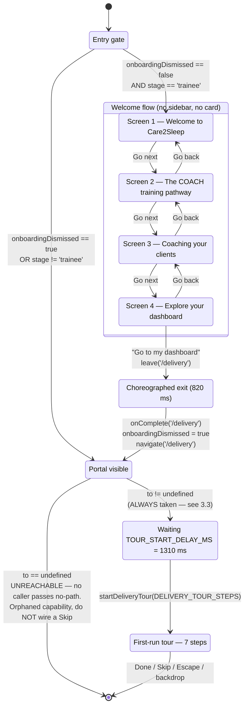
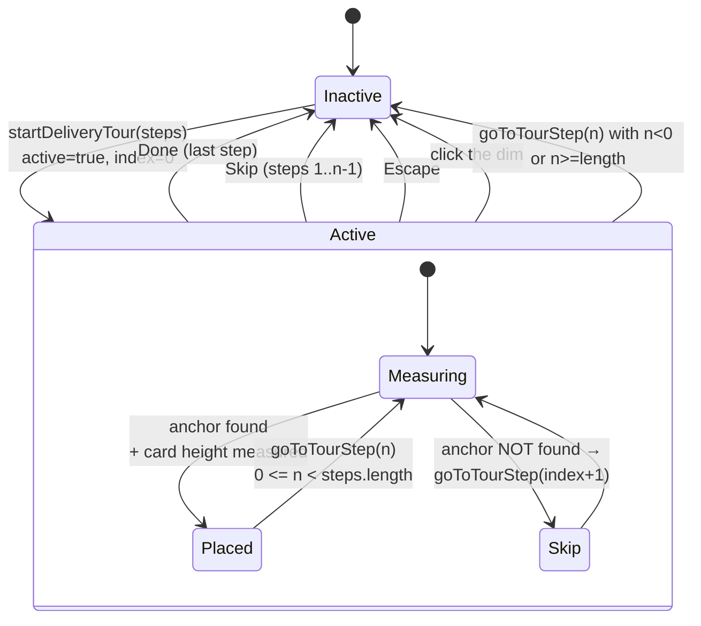
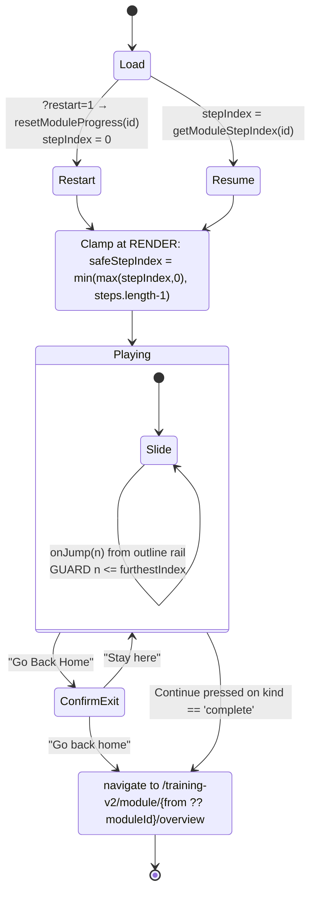
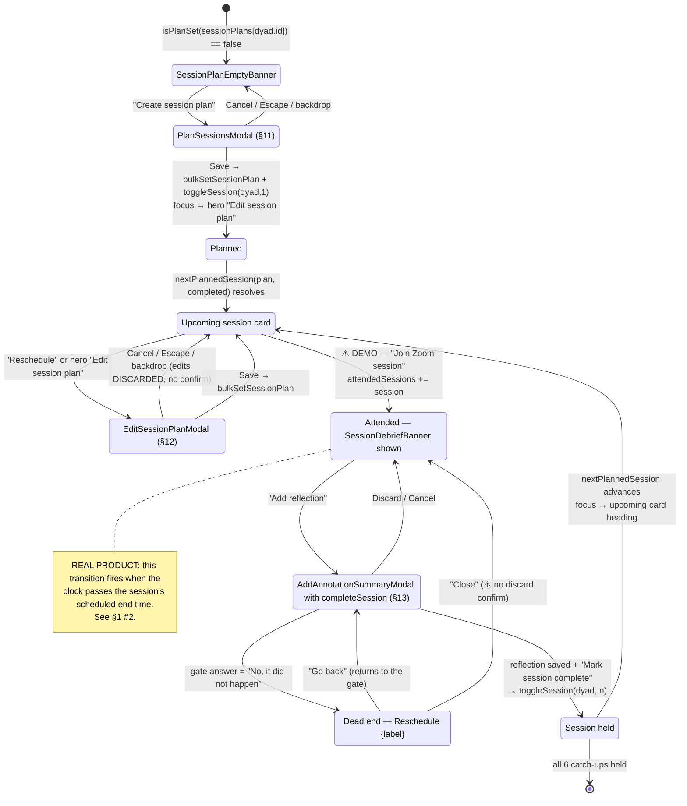
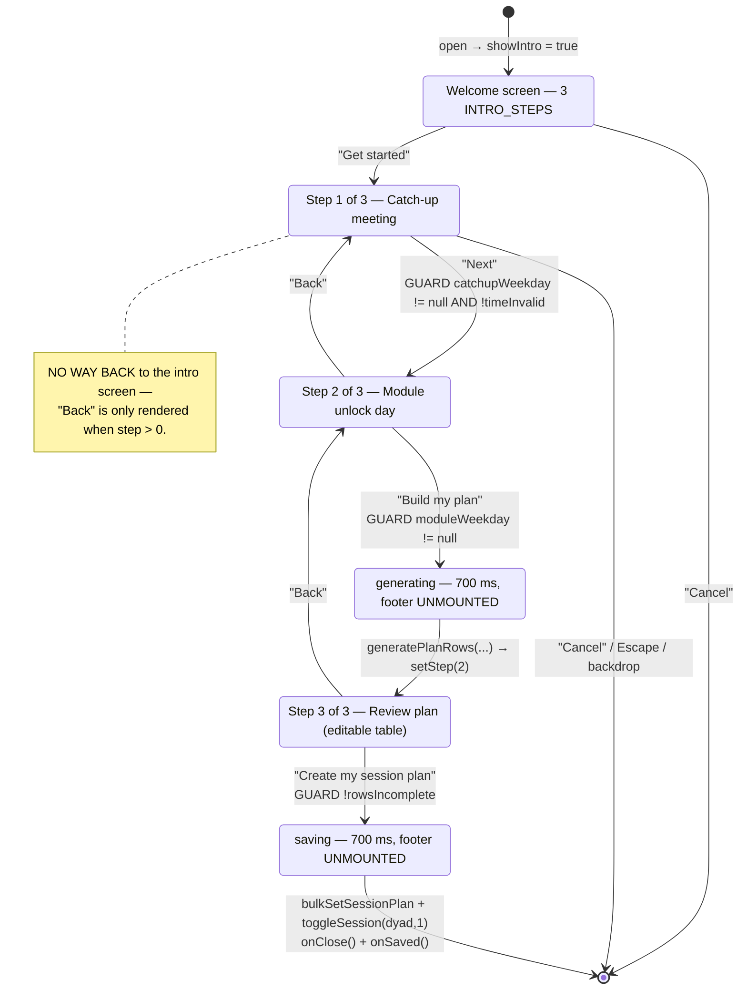
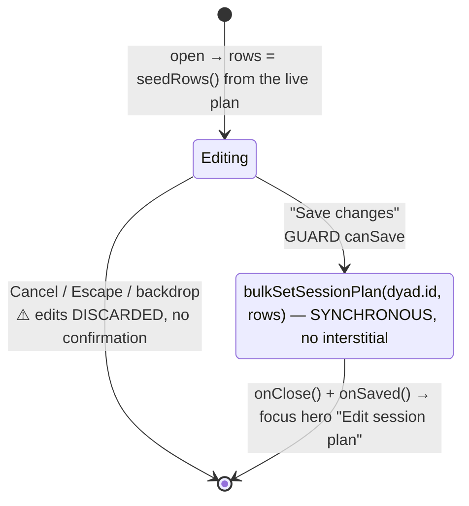
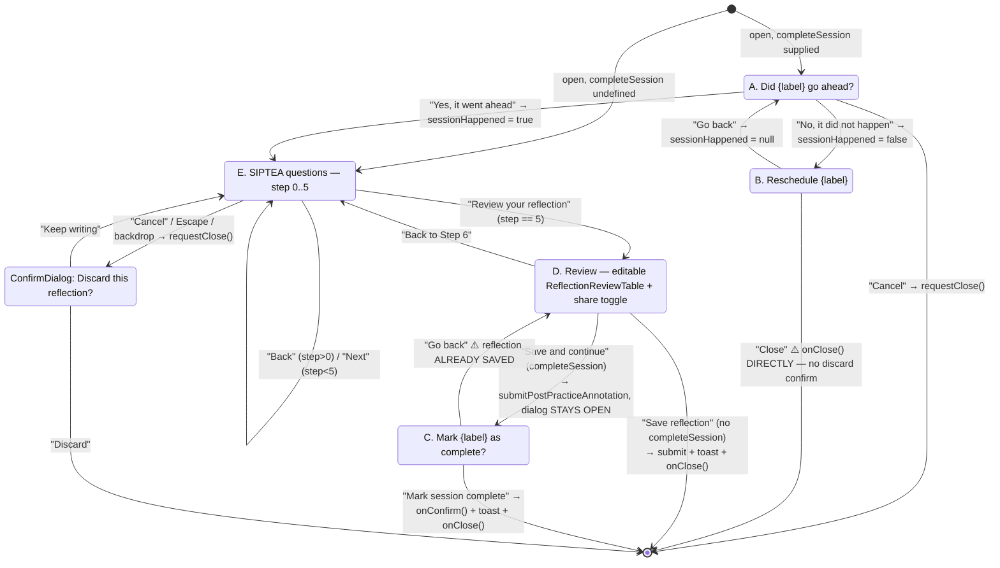

# Coach Delivery Portal — Orchestration & Flow Specification

**Purpose.** Every multi-step flow in the Coach Delivery Portal, written as an explicit state machine: states, transitions, guards, what persists, what resets, entry and exit conditions. Written to be implementable by an engineer who has the running app but cannot read React.

**Companion document.** `motion-spec.md` covers every animation. Where a flow's timing is animation-driven, this document names the constant and points there.

**Path convention.** All paths relative to `design/prototype/care2sleep-prototype/src/`.

> ### ⚠️ Read §1 before any other section.
> **Several of the state changes described in this document are driven by hidden demo triggers that do not exist in the real product.** Rebuilding them as product behaviour would be wrong, and missing the real automation they stand in for would also be wrong. §1 is the map. Every affected state machine below carries a cross-reference back to it.

---

## Table of contents

1. **Demo triggers vs. production behaviour** ← read first
2. Global state architecture — where state lives and why
3. Onboarding → tour handoff
4. The first-run tour state machine
5. The six derived Home banner states
6. The COACH pathway rail
7. The trainee Home stage-card system
8. Module player step machine
9. The trainee / coach demo stage switch
10. Session lifecycle — plan → join → debrief → complete
11. Wizard: Plan Sessions (create)
12. Wizard: Edit Session Plan
13. Wizard: SIPTEA reflection / session debrief
14. Known defects an engineer inherits

---

# 1. Demo triggers vs. production behaviour

This prototype has no backend. Nothing persists except two `localStorage` keys. To make every state reviewable, the prototype adds **shortcuts that let a reviewer jump to a state a real user would have to earn.**

**An engineer reading the code cannot tell these apart from real product behaviour.** This table is that distinction.

**Legend for the last column:**
- **DELETE** — remove entirely once the real driver exists. Do not repurpose.
- **KEEP (internal)** — genuinely useful as an internal/QA tool; gate it behind a flag rather than shipping it.
- **REPLACE** — the mechanism stays but its trigger changes.

| # | What you click in the prototype | What it changes | What drives this in the real product | File:line of the demo trigger | Verdict |
|---|---|---|---|---|---|
| **1** | **Any stage column on the "Your training journey" rail** — e.g. "Stage 2: Guided Group Practice" — **and the certification column** ("Congratulations! You are now a certified Sleep Coach!") | Sets `activeStage`. Changes the hero banner, the left stage card, the notes-banner pairing, the greeting, and (at the certification index) fires the confetti | **Automated.** The stage advances off real progress: module completions for Stage 1, session attendance for Stages 2–4, assessment outcome for Stage 4→5, reflection submission for Stage 5→6, and the expert assessor's certification decision for the final column. **The rail is a progress indicator, not a control** | `DeliveryHomePage.tsx:1463–1467` (stages) and `:1501–1504` (certification); state at `:2111`, wired `:2206` | **DELETE.** The comment at `:1456–1462` says so explicitly: *"Delete it if one ever lands; do not repurpose it into stage navigation, which is not what a coach does here."* Render the same columns as non-interactive `<li>` with `aria-current="step"` |
| **2** | **"Join Zoom session"** on a client's Upcoming session card | Adds the session number to `attendedSessions`, which reveals the **"How did Session N go?" debrief banner** — the only route to the reflection wizard | **The clock passing the session's end time.** A prototype with a frozen `TODAY` cannot demonstrate elapsed time, so joining the call stands in for "the session happened" | `DeliveryConsumerDetailPage.tsx:1720–1727` (button) → `:2484–2490` (handler); state `:2068` | **REPLACE.** The Zoom button should open the real `zoomLink` (it is currently a `<button>`, not a link — direct instruction: *"no need to open zoom tab, just show banner"*). The debrief banner should appear on a scheduled-end-time elapsed condition |
| **3** | **Bottom-right floating pill: "Demo view — Trainee / Coach"** | Switches the entire portal between the trainee dashboard and the certified-coach dashboard: Home layout, sidebar rows, whether onboarding runs at all, which tour opens, which meeting rows show | **Account state.** A coach is a trainee until certification, then a coach. There is exactly one persona (Helen Zhang) in this prototype and no certification write path | `CoachStageSwitcher.tsx:51` (click), `:52–57` (arrow keys); store `data/coachStage.ts:26, 34–38`; mounted globally at `DeliveryShell.tsx:358` | **DELETE.** `CoachStageSwitcher.tsx:17–20`: *"a review tool, not product chrome… If this prototype ever gains a real certification write path, this control should be deleted, not repurposed."* |
| **4** | *(no click — a data map)* `DEMO_PLAYER_REDIRECTS` | Module 2 ("Population Understanding") opens module 5's ("Understanding Sleep") content **and shares its progress key** | Nothing. Module 2 will have its own authored content | `pages/training-v2/pathway.ts:73–75`; resolver `realPlayerContentId()` `:79–81` | **DELETE.** Let `realPlayerContentId` become an identity function. **This map is the reason `resumableModule()` must read only the current module — see §5.2** |
| **5** | Any module CTA that reaches the player | Writes `training-v2:module-progress:{moduleId}` to `localStorage` | Real, but server-side and keyed to the coach's account, not the browser | `moduleProgressStore.ts:14–16, 51–61` | **REPLACE** the storage tier. The monotonic-forward rule (`:58`) is real product logic and should survive |
| **6** | **"Restart" / "Restart Module"** on a module overview or timeline card | Appends `?restart=1`, which **deletes the stored progress key** | Plausibly real, but it destroys progress with **no confirmation dialog**, and the URL param can be typed by hand | `ModuleOverviewPage.tsx:223, 243`; consumed `ModulePlayerPage.tsx:48, 60–63` | **REPLACE.** Keep restart, add a confirm, and do not accept it from a URL parameter |
| **7** | **Knowledge check — any answer advances** | `canContinue` is `revealed && isLast`. Answering **wrong** advances. Free-text questions advance on "Show answer" with an empty box. No score is computed or stored anywhere | A real mastery gate. Nothing in the file says this is scaffolding — **this one is undocumented and easy to miss** | `KnowledgeCheckScreen.tsx:38`, `:106` | **REPLACE.** This is the least obvious item in this table |
| **8** | **Play on any video thumbnail** | A 3.2-second simulated watch-through fills a progress bar and marks the video Watched — while the badge beside it reads "~4–5 min" | Real video playback | `VideoPlaceholder.tsx:18, 66–80` | **REPLACE.** `SIMULATED_DURATION_MS = 3200` is not a design value |
| **9** | *(automatic on every page load)* The **welcome flow replays** | `onboardingDismissed` is a module-scope `let`, reset on every real page load | A first-run flag **keyed to the coach, stored server-side**. `DeliveryShell.tsx:13–19` says exactly that | `DeliveryShell.tsx:28`, gate `:165`, set `:171` | **REPLACE** the persistence. The flow itself is real product |
| **10** | **"Take tour" / "Skip tour"** on the coach welcome banner | `showWelcome` local state; "Take tour" opens `COACH_TOUR_STEPS` | Real product behaviour, but the banner should be dismissed **permanently** once taken or skipped | `DeliveryHomePage.tsx:2323, 2330`, wired `:2640–2641`; auto-hide watcher `:2557–2566` | **REPLACE** the persistence. ⚠️ The doc comment at `:2265–2272` still calls "Take tour" unwired — **that comment is stale**, it was wired in Round 40 |
| **11** | **"Dismiss"** on the "How did {stage} go?" banner | `dismissedNotes` local array. Reappears on refresh, and can be re-triggered by moving the rail (#1) | A real per-stage dismissal, persisted | `DeliveryHomePage.tsx:1075–1082`, handler `:2145–2150`, state `:2112` | **REPLACE** the persistence |
| **12** | **"Dismiss all" / per-row "Dismiss"** on This week's priorities | A local `Set<string>`. Nothing is written to the store, so priorities **reappear on navigating away and back** | Real dismissal, persisted, probably with a snooze window | `PrioritiesSection.tsx:120` (all), `:196` (row); state `:69` | **REPLACE** the persistence |
| **13** | **Add / View / Download / Delete** on My Notes | Module-scope `let notes`. Refresh returns to three seeded rows | Real CRUD against the coach's own notes | `DeliveryNotesPage.tsx:184, 420, 427, 441`; store `data/coachNotes.ts:37` | **REPLACE** the persistence. The three seed rows are **rewritten frame content, not real data** (`coachNotes.ts:28–36`) |
| **14** | **"Download my certificate" / "Download certificate"** (three call sites) | `fetch('/illustrations/certificate-earned.svg')` and saves it | A generated, per-coach PDF certificate | `DeliveryHomePage.tsx:1004`, `:1909`; `DeliveryAccountPage.tsx:225`, handler `:165–176` | **REPLACE.** Reachable on Home purely by clicking the certification node on the rail (#1). The file is a real committed asset rather than a fabricated document, deliberately |
| **15** | *(researcher portal — out of the coach portal but it writes coach-visible state)* **"Mark as incomplete"** and **"Unlock module"** in `SessionTracker` | `toggleSession` reversal; `unlockModuleManually(dyadId, moduleIdx)` | **"Mark as incomplete" is a real researcher override** for correcting mistakes. **"Unlock module" is an explicit bypass** — its own confirm body says *"Normally that's what unlocks it"* | `SpacesCoachProfilePage.tsx:1844` (incomplete), `:1826` → `:1953` (unlock); store `research-store.tsx:618–624` | **KEEP (internal)** for "Mark as incomplete". **KEEP (internal)** for "Unlock module" — it is a legitimate admin escape hatch, but it must never be exposed to a coach. `SessionTracker` is no longer imported by the delivery portal (`DeliveryConsumerDetailPage.tsx:33–35`) |
| **16** | *(a constant, not a click)* `STAGES_WITH_NOTES = new Set([1, 2])` | Stage 4's notes banner **is built and deliberately withheld**. Turning it on is one number | Product decision, pending | `DeliveryHomePage.tsx:877` | **KEEP** as a config, but it is a feature flag, not a bug |
| **17** | *(a constant, not a click)* `DISPLAY_OVERRIDES = {}` | An empty display-override hook "kept for parity with Round 6.3" | Nothing | `pathway.ts:46`, consumed `:139`, `:145` | **DELETE.** Dead mechanism |
| **18** | *(a constant, not a click)* `PLAN_ANCHOR = toLocalISODate(new Date())` | Both plan wizards anchor generated dates to the **real wall-clock date**, not the seed world's frozen `TODAY`. A freshly created plan therefore lives weeks ahead of every seeded plan | Real dates | `PlanSessionsModal.tsx:29–35`; same in `EditSessionPlanModal.tsx:16–18` | **REPLACE.** A deliberate demo-fidelity trade-off that will look like a bug to a reviewer comparing a new plan against a seeded one |

## 1.1 Unwired controls — focusable, announced, and doing nothing

These are **not** demo shortcuts. They are the project's documented treatment for a control the design calls for but which has no destination yet: a focusable `aria-disabled="true"` button carrying an `sr-only` "(coming soon)" cue. Never a silently dead button, never omitted.

An engineer needs the list because every one of them is a feature that must be built.

| Label | File:line | Why it is inert |
|---|---|---|
| "Need help" (both stages, greeting row) | `DeliveryHomePage.tsx:346–348` | No destination |
| "Learn more" (stage-expect banner) | `DeliveryHomePage.tsx:947–955` | No per-stage detail page |
| "Learn more" (Your training journey card header) | `DeliveryHomePage.tsx:1391–1399` | No "about the pathway" page |
| "Know more" (certification banner) | `DeliveryHomePage.tsx:1012–1020` | No "about SPACES delivery" page |
| **"Share my reflection"** (hero banner **and** Stage 5 card) | `DeliveryHomePage.tsx:1152–1168` and `:2000–2005`; label constant `REFLECTION_CTA_LABEL` `:1309` | **The reflective-conversation tool does not exist.** These are two entry points to *one* action — wire both together |
| Stage resource rows — "Session guidelines", "SIPTEA component reference card", "Peer feedback templates", "Simulated client profiles", "Session agenda", "Placement feedback report", "Intervention agenda", "What happens next" | Generic renderer `DeliveryHomePage.tsx:1738`, cue `:1757`; rows at `:1806–1810`, `:1842–1848`, `:1886+`, `:1917–1921`, `:1943–1948` | **Dummy cards** — no download path, and generating a file would be fabricating content. Only "Your certificate" (`:1909`) is wired |
| "Join role-play / assessment / intervention session" | `DeliveryHomePage.tsx:1789` (`LockedSessionCta`) | **Locked by design**, not "coming soon" — the `sr-only` cue is the real session date |
| "Join Zoom session" (already held) | `DeliveryConsumerDetailPage.tsx:1702–1711` | Cue: "(this session has already been held)" |
| "Join Zoom session" (no link) | `DeliveryConsumerDetailPage.tsx:1729–1737` | Cue: "(no meeting link yet)" |
| "Download certificate" (My profile) | `DeliveryAccountPage.tsx:218` | Conditionally inert — live once the researcher has generated the certificate |
| "Schedule new meeting" (My schedule) | `DeliveryMeetingsPage.tsx:137` | No scheduling write path for a coach |
| "Edit" / "Delete" on meeting rows | `MeetingsSection.tsx:197–198` | No write path |
| "Locked" module CTA | `ModuleTimeline.tsx:727–740` | Cue: "(complete the module above first)" — real gating |
| "Unlock" / "Download certificate" (certificate card) | `ModuleTimeline.tsx:841, 876` | ⚠️ **The certified branch has no `onClick` at all** — a genuinely dead button, not an `aria-disabled` one |
| Sidebar `pending` rows | `DeliverySidebar.tsx:214, 252` | The flag exists; **zero rows currently use it** (`:101–129`). Kept deliberately |

**Shared primitive:** `InertButton` at `components/shared/MeetingsSection.tsx:118–140`.

## 1.2 Dead files in this portal

| File | Status |
|---|---|
| `components/delivery/WidgetGrid.tsx` | **No importers.** Dead |
| `components/delivery/NotificationHub.tsx` | Consumed only by `components/research/ResearchNotificationHub.tsx:2`. Not used by any `/delivery` page |
| `pages/training-v2/player/ModulePlayerHeader.tsx` | Orphaned by the Round 33 player rebuild; left in place |
| `ReflectionCard` inside `DeliveryConsumerDetailPage.tsx` | No caller since Round 39; explicitly not deleted (`:2433–2438`) |
| `components/research/SessionTracker` (in `SpacesCoachProfilePage.tsx:1531`) | Still live in the **researcher** portal; removed from the coach portal |

---

# 2. Global state architecture

**There is no backend.** `data/research-store.tsx:45`: *"Nothing persists across a reload — this is a prototype, not a backend."*

## 2.1 The five module-scope singletons

**This is the most important architectural fact in the portal, and it exists because of a real bug that shipped.**

> **Every page under `/delivery` mounts its own `DeliveryShell` instance.** React Router replaces the whole element tree on navigation. Therefore **anything that must survive in-app navigation cannot be `useState` in a shell.**
>
> Round 29 shipped exactly this: the onboarding-dismissed flag lived in `useState` in `DeliveryShell`. Once the final CTA started routing to another page, the destination mounted a *fresh* shell, read `false`, and **replayed the entire welcome flow**. Documented at `DeliveryShell.tsx:20–27`.

The five singletons, all module-scope `let`/`const`, all resetting on a real page load:

| # | Variable | File:line | Survives navigation | Survives refresh | Reader mechanism |
|---|---|---|---|---|---|
| 1 | `onboardingDismissed` | `DeliveryShell.tsx:28` | ✅ | ❌ | plain read + local `useState` seed |
| 2 | `active` / `index` / `steps` (tour) | `data/deliveryTour.ts:202–207` | ✅ | ❌ | `useSyncExternalStore` |
| 3 | `stage` (trainee/coach) | `data/coachStage.ts:26` | ✅ | ❌ | `useSyncExternalStore` |
| 4 | `notes` (My Notes) | `data/coachNotes.ts:37` | ✅ | ❌ | `useSyncExternalStore` |
| 5 | `startedThisSession` (`Set<string>`) | `moduleProgressStore.ts:44` | ✅ | ❌ | plain read |

> **`useSyncExternalStore` requires the snapshot to be identity-stable.** `deliveryTour.ts:210–217` keeps one `snapshot` object and replaces it only in `emit()`. Returning a fresh object on every call loops forever.

## 2.2 The only two persisted keys

| `localStorage` key | Written by | Purpose |
|---|---|---|
| `training-v2:module-progress:{moduleId}` | `moduleProgressStore.ts:59` | Furthest player step index reached. Monotonic — never regresses |
| `c2s-delivery-nav-collapsed` | `DeliverySidebar.tsx:141` | Sidebar collapse preference |

## 2.3 The React context store

`data/research-context.tsx` / `data/research-store.tsx`, in-memory only. Actions the coach portal calls:

| Action | Effect | File:line |
|---|---|---|
| `toggleSession(dyadId, sessionNumber)` | Marks a session held / not held | `research-store.tsx` |
| `bulkSetSessionPlan(dyadId, rows)` | Replaces a client's whole 7-row plan | `:594` |
| `submitPostPracticeAnnotation(dyadId, components, shared, session)` | **Prepends** a reflection to `annotationSummaries` | `:705–738` |
| `unlockModuleManually(dyadId, moduleIdx)` | Researcher override (see §1 #15) | `:618–624` |
| `updateSupervisionNote(id, patch)` | Patches a case note **by id**, not by replacement | — |
| `addAdHocMeeting(...)` | **Has no UI caller in any portal** since Round 36 | — |

---

# 3. Onboarding → tour handoff

**The single most-asked-about flow in this portal.**

## 3.1 States



## 3.2 Entry condition

`DeliveryShell.tsx:165`

```ts
const showOnboarding = !onboarded && stage === 'trainee'
```

**Both halves matter.** A certified coach has long since been through the welcome flow; showing it would be telling them they are about to start training. Flipping the demo stage switch to "Coach" therefore also skips onboarding — see §1 #3.

## 3.3 The trainee welcome flow is MANDATORY — there is no Skip, by design

> ### 🚫 DO NOT "FIX" THIS. Read this section before touching `DeliveryOnboarding` or `DeliveryShell`.
>
> **The four-screen "Welcome to Care2Sleep" flow has no skip path, and that is deliberate product design — confirmed by the client.**
>
> **Every trainee is required to see it. It is an induction into the study, not a dismissible product tour.**
>
> **The code around it is actively misleading, and that is the real risk.** Three separate comments in `DeliveryShell.tsx` describe a Skip control that does not exist, plus a CTA label ("Get started") that is not used either:
>
> | Comment | What it says | Reality |
> |---|---|---|
> | `DeliveryShell.tsx:167–168` | *"`to` is passed by the final slide's CTA … and omitted by Skip, which just reveals whichever page the coach is already on"* | There is no Skip |
> | `DeliveryShell.tsx:175` | *"`to` is the tell — Skip omits it"* | There is no Skip |
> | `DeliveryShell.tsx:184` | *"Skip and 'Get started' both unmount the control that was clicked"* | Neither control exists. The labels are "Go back" and "Go next"/"Go to my dashboard" |
>
> **An engineer reading those comments will reasonably conclude a button was lost and restore it. Restoring it would violate a deliberate study requirement.**
>
> The optional-argument mechanism itself — `completeOnboarding(to?: string)` — is **retained orphaned capability from Round 32**, when the branch genuinely had two callers. It is harmless and is left in place; it is **not** a hook waiting to be reconnected. If you are cleaning up, delete the stale comments rather than adding the button they describe.

`DeliveryShell.tsx:169–182`

```ts
const completeOnboarding = useCallback((to?: string) => {
  onboardingDismissed = true
  setOnboarded(true)
  if (to) navigate(to)
  if (to) window.setTimeout(startDeliveryTour, TOUR_START_DELAY_MS)
}, [navigate])
```

**Live callers, exhaustive:**

| Caller | Passes `to` | Navigates | Starts the tour | File:line |
|---|---|---|---|---|
| Final CTA "Go to my dashboard" | `'/delivery'` | ✅ | ✅ | `DeliveryOnboarding.tsx:581` |
| *(no-path branch)* | — | — | — | **No caller. Orphaned since Round 32** |

The only controls the component renders are "Go back" (screens 2–4) and "Go next" / "Go to my dashboard" (`DeliveryOnboarding.tsx:559–587`). The Figma frames dropped Skip and the dots (`:22–25`).

### The behavioural consequence is intended, not accidental

Because the final CTA is the only exit **and** the final CTA is what launches the tour:

> **A trainee always completes the four-screen welcome, and always enters the seven-step tour on first run.**

This document previously flagged that as a side effect worth questioning. **It is confirmed accepted behaviour.** The `if (to)` guard on the tour start is therefore not a live branch for the trainee — it is what keeps the *shape* of the contract honest, and it is what the coach-stage entry point (`startDeliveryTour(COACH_TOUR_STEPS)` from the welcome banner, §4.1) sits alongside without colliding.

### The three surfaces have three different exit rules — all intentional

An engineer will notice the inconsistency and should not normalise it:

| Surface | Skip available? | Rule |
|---|---|---|
| **Trainee onboarding** (4 screens) | ❌ **Never** | Mandatory study induction. Back only. Completion is the only exit |
| **First-run tour** (7 steps trainee / 5 coach) | ✅ **On every step except the last** | Optional orientation. Also exits on Escape or a click on the dim. No Skip on the last step because "Done" already means the same thing (`DeliveryTour.tsx:514`) |
| **Coach welcome banner** (Home) | ✅ **"Skip tour"** | Optional. Dismisses the banner without starting the walkthrough (`DeliveryHomePage.tsx:2330`) |

The trainee onboarding is the only mandatory surface of the three. Do not add a Skip to it, and do not remove Skip from the other two.

> ### ⚠️ One genuine latent trap, unrelated to the above
>
> `startDeliveryTour(which = DELIVERY_TOUR_STEPS)` (`deliveryTour.ts:228`) is passed **directly** to `setTimeout` at `DeliveryShell.tsx:179`. `setTimeout` invokes its callback with a **timer id** as the first argument on some runtimes, which would land as the `which` step array. It currently works because browsers call it with no arguments. Wrap it: `() => startDeliveryTour()`.

## 3.4 Why "Go to my dashboard" names its destination explicitly

`DeliveryOnboarding.tsx:571–581`. The no-path version only *uncovers* whatever page the flow was rendering over — and **this flow covers every `/delivery` page**, because every one mounts its own shell. Entering the portal on `/delivery/learning` and finishing the welcome therefore landed the coach on My Learning, which is not what the button says. `HOME_PATH = '/delivery'` (`:338`) makes it true from wherever the flow was entered.

## 3.5 Persistence summary

| Fact | Persists? | Where |
|---|---|---|
| Onboarding dismissed | **Navigation only** | `DeliveryShell.tsx:28`, module scope |
| Current screen index | Component `useState` (`:373`) | Lost on unmount |
| Tour active / index / step array | **Navigation only** | `deliveryTour.ts:202–207` |
| Tour completed | **Not tracked at all** | — |

**Consequence for reviewers:** every page load replays four onboarding screens and then a seven-step tour, and there is no re-entry point for the tour once dismissed.

Two separate things are going on here and only one of them is scaffolding:

- **That the welcome runs at all, and runs to completion, is intended product behaviour** (§3.3). Keep it.
- **That it runs again on every page load is prototype scaffolding.** `onboardingDismissed` is a module-scope `let` (`DeliveryShell.tsx:28`), deliberately not persisted so a reviewer sees the flow on every look without clearing storage by hand (`:13–19`). A real build stores a first-run flag **server-side, keyed to the coach, not the browser** — the file says exactly that. See §1 #9.

The tour's own "completed" state is not tracked at all, which is the same scaffolding decision one level down.

## 3.6 Timing

See `motion-spec.md` §2.5 for the full choreography. The orchestration-relevant numbers:

| Constant | Value | File:line |
|---|---|---|
| `EXIT_MS` | **820 ms** — click to `onComplete()` | `DeliveryOnboarding.tsx:362` |
| `PAGE_REVEAL_DELAY_S` | **0.3 s** | `DeliveryShell.tsx:38` |
| `TOUR_START_DELAY_MS` | `(0.3 + 0.16 + 0.85) × 1000 + 40 = **1310 ms**` | `DeliveryShell.tsx:58` |
| **Total, click → tour** | **2130 ms** (live-measured 2201 ms with 50 ms polling granularity) | |

**`TOUR_START_DELAY_MS` is written as a sum, not a literal, and must stay that way.** The tour measures the elements it points at; measuring them mid-fade — while a `motion.div` still carries a `transform` — puts a coachmark beside where its anchor *was*. Every number it depends on has changed at least once. If you replace it with `1310`, a future retune of the reveal will break the tour silently.

## 3.7 Focus

`DeliveryShell.tsx:198–200` — when `onboarded` flips, focus moves to `#main-content` (which carries `tabIndex={-1}`).

Two details, both earned:

- **An effect, not `requestAnimationFrame`.** A first pass used rAF and measured focus landing on `<body>` anyway, because **rAF is throttled in a background or preview tab** (the same mechanism Rounds 16 and 17 traced focus bugs to). An effect fires in React's own commit cycle with no such dependency.
- **`preventScroll: true`.** Without it, focusing `main` scrolled the page 79 px and cut the top off the hero the coach had just been handed.

Within the flow, `DeliveryOnboarding.tsx:397–400` uses a **callback ref keyed on `step`** to focus each screen's `<h1>`. A callback ref rather than an effect because React invokes it synchronously on mount, where an effect scheduled against an exiting element can fire against a stale node. This is what announces the new screen — and Back specifically unmounts the control that was clicked, which is this project's most-repeated defect.

---

# 4. The first-run tour state machine

`components/delivery/DeliveryTour.tsx` · `data/deliveryTour.ts`

## 4.1 Two step arrays, one component

| Array | Steps | Opened by | File:line |
|---|---|---|---|
| `DELIVERY_TOUR_STEPS` | **7** (trainee) | Onboarding's final CTA only | `deliveryTour.ts:46–108` |
| `COACH_TOUR_STEPS` | **5** (certified coach) | The welcome banner's "Take tour" | `deliveryTour.ts:127–180` |

**Live-verified: the trainee tour reports "Step 1 of 7".**

Which array is running is held in the **store** (`steps`, `:207`), not derived from the coach stage — *"so a caller opens the tour it means to open"*. Two distinct entry points, two explicit calls.

### Trainee steps

| # | `anchor` | Title | `prefer` |
|---|---|---|---|
| 1 | `home-greeting` | Welcome to your dashboard | bottom |
| 2 | `training-pathway` | Your training journey | bottom |
| 3 | `learning-progress` | Your stage details | right |
| 4 | `meeting` | My meeting | left |
| 5 | `nav-learning` | My Learning | right |
| 6 | `nav-notes` | My Notes | right |
| 7 | `nav-profile` | My Profile | right |

Step 1 carries `cta: 'Start tour'` (`:50`) — it is an invitation the onboarding hands straight into. Every other step's advance button reads "Next", or "Done" on the last.

### Coach steps

| # | `anchor` | Title | `prefer` |
|---|---|---|---|
| 1 | `home-greeting` | A quick look around | bottom |
| 2 | `quick-overview` | Quick overview | right |
| 3 | `priorities` | This week's priorities | left |
| 4 | `clients-table` | Clients assigned to you | right |
| 5 | `nav-schedule` | My Schedule | right |

The coach's step 1 has **no `cta` override** — it is a real content step reached by pressing "Take tour", and a card saying "Start tour" *after* the tour has visibly started tells the coach the opposite of what happened.

## 4.2 State machine



## 4.3 Store API

`data/deliveryTour.ts:228–248`

| Function | Behaviour |
|---|---|
| `startDeliveryTour(which = DELIVERY_TOUR_STEPS)` | `active = true`, `index = 0`, `steps = which`, emit |
| `endDeliveryTour()` | `active = false`, `index = 0`, emit. **Does not reset `steps`** — harmless, since `start` always sets it |
| `goToTourStep(next)` | Out of range → `endDeliveryTour()`. Otherwise `index = next`, emit |

## 4.4 Guards and edge cases

| Guard | Behaviour | File:line |
|---|---|---|
| **Missing anchor** | `goToTourStep(index + 1)` — silently skip. *"A missing anchor is a wiring bug, not a user-facing state: rather than dimming the whole screen around nothing, skip to the next step"* | `:194–199` |
| **Last step has no Skip** | *"there is nothing left to skip past, and offering two ways out of the same card where one is already labelled 'Done' only asks the coach to work out whether they differ"* | `:514` |
| **Step 1 has no Previous** | The slot is **held** with an empty `<span aria-hidden>` so Next does not slide left on step 1 and jump right on step 2 | `:543–545` |
| **Clicking the dim ends the tour** | Same as Skip. `tabIndex={-1} aria-hidden` — not a focus stop, just the forgiving way out | `:425–431` |
| **Escape ends the tour** | Handled in the same `keydown` listener as the Tab trap | `:317–321` |
| **Tab is trapped in the card** | Wraps `first ↔ last`, treating the heading as equivalent to `first` for Shift+Tab | `:322–336` |

## 4.5 The interpolated stage count — a rule, not a nicety

Trainee step 2's body contains `{stageCount}`, filled at render by `tourStepBody(step, stageCount)` (`:187–189`).

`DeliveryHomePage.tsx:2254` passes `STAGE_COUNT_WORD[PATHWAY_STAGES.length]`, derived from `data/coachPathway.ts`.

> **This sentence has been shipped wrong three times.** The Figma frames say *"the five stages"* over a rail that draws **six**. Round 31 shipped "Complete all five stages" above a six-stage rail. Round 32 found it again in the tour copy. **Any surface stating how many stages there are must read `PATHWAY_STAGE_COUNT_WORD`, never write a number.**

This is also why `DeliveryTour` is mounted on `DeliveryHomePage` (`:2253`) rather than in `DeliveryShell`: the shell cannot import the rail's constant without closing an import cycle (`DeliveryHomePage → DeliveryShell → DeliveryOnboarding`), which is the same constraint that put `PATHWAY_STAGE_COPY` in `data/` in the first place.

## 4.6 Side effect — the coach welcome banner self-dismisses

`DeliveryHomePage.tsx:2557–2566`

```ts
const { active: tourActive } = useDeliveryTour()
const tourWasStarted = useRef(false)
useEffect(() => {
  if (tourActive) tourWasStarted.current = true
  else if (tourWasStarted.current) { tourWasStarted.current = false; setShowWelcome(false) }
}, [tourActive])
```

**Watched as a transition, not hooked to the Done button**, because the tour can also end from Skip, Escape or a backdrop click and all four mean the same thing. `tourWasStarted` is what stops the effect firing on mount, when `active` is already false and nothing has happened yet.

---

# 5. The six derived Home banner states

`DeliveryHomePage.tsx` — trainee stage only.

> **Cross-reference §1 #1.** The `activeStage` that selects most of these is set by **clicking the pathway rail**, which is a demo control. In the real product `activeStage` is derived from progress.

## 5.1 Selection logic

The banner slot is a three-way branch (`:2194–2200`) with `TrainingBanner` itself splitting three ways internally (`:1110–1239`).

```mermaid
flowchart TD
    A[activeStage] --> B{activeStage == PATHWAY_STAGES.length<br/>i.e. the certification column?}
    B -- yes --> C["<b>6. Certification</b><br/>yellow-300 · Confetti · Download my certificate"]
    B -- no --> D{activeStage == 0<br/>OR activeStage == REFLECTION_STAGE_INDEX?}
    D -- no --> E{STAGE_BANNER_COPY has this index?}
    E -- yes --> F["<b>3. stage-expect</b><br/>purple-300 · 'You are now in: Stage N'"]
    E -- no --> G["(no banner)"]
    D -- yes --> H{reflecting == true?<br/>i.e. activeStage == REFLECTION_STAGE_INDEX}
    H -- yes --> I["<b>5. My reflection</b><br/>yellow-200 · 'Share your reflection'<br/>CTA unwired"]
    H -- no --> J{resumableModule&#40;&#41; truthy?}
    J -- yes --> K["<b>2. Resume</b><br/>primary · module name · Resume learning"]
    J -- no --> L["<b>1. Begin</b><br/>primary · Go to My Learning"]

    M[notesStage = activeStage - 1] --> N{activeStage > 0<br/>AND STAGES_WITH_NOTES.has&#40;notesStage&#41;<br/>AND not dismissed?}
    N -- yes --> O["<b>4. stage-notes</b><br/>yellow-200 · 'How did {stage} go?'<br/>ADDITIONAL, stacked 16px above"]
```



## 5.2 The six states, with exact conditions

| # | State | Exact condition | Ground | Primary action | File:line |
|---|---|---|---|---|---|
| **1** | **Begin** | `activeStage === 0` ∧ `!resumableModule()` | `primary` | Link → `/delivery/learning` | `:1215–1239` |
| **2** | **Resume** | `activeStage === 0` ∧ `resumableModule()` truthy | `primary` | Link → `/training-v2/module/{realPlayerContentId(id)}/play?from={id}` | `:1173–1213` |
| **3** | **stage-expect** | `activeStage ∈ {1,2,3,5}` (keys of `STAGE_BANNER_COPY`) | `purple-300` on `purple-500` | "Learn more" — **unwired** | `:917–958` |
| **4** | **stage-notes** | `activeStage > 0` ∧ `STAGES_WITH_NOTES.has(activeStage − 1)` ∧ not dismissed | `yellow-200` on `yellow-300` | Link → `/delivery/notes?title={stage} - how it went` | `:1037–1086` |
| **5** | **My reflection** | `activeStage === REFLECTION_STAGE_INDEX` (4) | `yellow-200` | "Share my reflection" — **unwired** | `:1113–1171` |
| **6** | **Certification** | `activeStage === PATHWAY_STAGES.length` (6) | `yellow-300` | "Download my certificate" — **live**. Fires the confetti | `:974–1026` |

**States 4 and 6 are the only ones that can coexist with another banner.** State 4 stacks 16 px above whichever of 1/2/3/5/6 is showing (`:2190–2201`) — deliberately tighter than the page's 48 px rhythm, so the pair reads as one block. **Notes first, then the next stage** — the reverse of the frame's own order, because it reads better as a sequence: close off what just happened before being told what is coming.

## 5.3 `resumableModule()` — why it reads ONLY the current module

`pages/training-v2/pathway.ts:128–134`

```ts
export function resumableModule(): TrainingModuleV2 | undefined {
  if (firstIncompleteIndex === -1) return undefined
  const module = PATHWAY_MODULES[firstIncompleteIndex]
  if (!module) return undefined
  if (!wasStartedThisSession(realPlayerContentId(module.id))) return undefined
  return livePlayerStatus(module.id)?.status === 'in-progress' ? module : undefined
}
```

**This is load-bearing, not an optimisation. Cross-reference §1 #4.**

Live progress is keyed by **content id**. `DEMO_PLAYER_REDIRECTS` points module 2 (`population-understanding`) at module 5's content (`understanding-sleep`), so **both modules read the same `localStorage` entry.**

A scan across all eleven modules would therefore report **locked module 5 as in-progress the moment a coach touched module 2**. That is the exact collision Round 19.1 had to fix on the timeline cards — a locked module silently inheriting another module's progress.

Reading only `firstIncompleteIndex` sidesteps it **structurally**: a locked module can never be the answer, because it is never the current one.

Going through `livePlayerStatus()` rather than a second progress read is the other half — the banner and the module card now derive from **one** fact, so they cannot disagree about whether a module is under way.

### The two-fact split: `wasStartedThisSession` vs the stored index

`moduleProgressStore.ts:26–48`

| Fact | Storage | Lifetime | Why |
|---|---|---|---|
| *How far in are they?* | `localStorage` | Survives a closed tab | Progress should not be lost |
| *Have they picked it up this sitting?* | module-scope `Set` | Dies on refresh | **A refresh must return the demo to the "Begin your training journey" banner** (direct instruction) |

Without the second fact, the banner would pin to "Resume" **forever** once any module had ever been opened. These are genuinely different facts, not a redundancy.

`setModuleStepIndex` adds to the Set **unconditionally**, outside the `index > current` guard (`:55`): a coach returning to a module they finished in a previous session never advances the stored index, but they have still started it now.

## 5.4 The greeting is derived from the same read

`DeliveryHomePage.tsx:891–907`

```ts
function greetingFor(activeStage, resuming) {
  const started = resuming || activeStage !== 0
  return started
    ? { heading: 'Welcome back, Helen,', sub: 'Ready to continue your training?' }
    : { heading: 'Hello Helen,',        sub: 'Welcome to the Care2Sleep training dashboard. …' }
}
```

Called with `!!resumableModule()` (`:2114`) — **the same read the banner switches on**, so the greeting and the banner cannot contradict each other. The long orientation line survives exactly one situation: Stage 1, nothing begun. Which is the only time it tells the coach something they do not already know.

## 5.5 Notes pairing — a documented, one-character-reversible decision

`:2129–2146`

```ts
const notesStage = activeStage - 1
```

**The stage *before* the current one is the one there is something to write up about.** So the prompt for Guided Group Practice appears once the coach has moved on to Peer Role-Play, not while they are still in it.

Frame `637:10671` pairs same-stage, which is the other reading — **but that frame's own rail shows Stage 1 as "Ongoing" underneath a banner announcing Stage 2**, so it is a layout reference rather than a coherent state, and the written brief wins. Flipping is changing `activeStage - 1` to `activeStage` on that line.

`STAGES_WITH_NOTES = new Set([1, 2])` (`:877`). **Stage 4's banner is built and deliberately withheld** — see §1 #16.

## 5.6 Dismissal and focus

`:2145–2150`

```ts
function dismissNotes(index) {
  setDismissedNotes(prev => [...prev, index])
  pathwayHeadingRef.current?.focus()
}
```

The Dismiss button unmounts with the banner, so focus **must** be sent somewhere deliberate or it falls to `<body>` — this project's most-repeated defect, shipped in six separate rounds. The pathway heading carries `tabIndex={-1}` (`:1371`) to be a programmatic-only target.

---

# 6. The COACH pathway rail

> ### ⚠️ Cross-reference §1 #1 — **the rail is a demo control here, and a progress indicator in the real product.**
> Clicking a stage is how you *view* that stage's dashboard state. In production the stage advances automatically off module completions, session attendance and assessment outcomes. `DeliveryHomePage.tsx:1456–1462` states this and says to delete the buttons, not repurpose them.

## 6.1 Structure — six stages plus a certification column

`data/coachPathway.ts:23–30`

| Index | `stage` | `label` | Icon (`DeliveryHomePage.tsx:1285`) |
|---|---|---|---|
| 0 | Stage 1: | Content Learning | `BookOpen` |
| 1 | Stage 2: | Guided Group Practice | `Users` |
| 2 | Stage 3: | Peer Role-Play | `Drama` |
| 3 | Stage 4: | Hands-on Assessment | `ClipboardCheck` |
| 4 | Stage 5: | My Reflection | `NotebookPen` |
| 5 | Stage 6: | Live Intervention | `HeartHandshake` |
| **6** | *(certification column)* | Congratulations! You are now a certified Sleep Coach! | `Award` |

**Seven clickable columns; six stages.** `activeStage === PATHWAY_STAGES.length` (6) means certified, and every stage before it reads complete (`:1495–1498`).

Icons are zipped onto the shared copy list **by index** (`:1287–1290`) so a stage can never render another stage's glyph. Copy lives in `data/` because the onboarding flow reads it too and cannot import the page (import cycle).

**Three icons deliberately diverge from the Figma export**, and the reasons are worth keeping (`:1253–1272`):
- Stage 3's export is literally *a circle with an X through it* — which every other UI in this app uses for "error" or "dismissed". In a **progress** rail it read as a failed stage. → `Drama` (theatre masks).
- Stage 5 was `message-square`; a speech bubble says "conversation", but the reflection is something the coach **writes**. → `NotebookPen`, matching the app's own reflection panel.
- Stage 6 was `video` — correct about the medium, but it is **the same glyph as the "Join Zoom" button further down the same page**, so on one screen it meant both "a stage of your training" and "a button that opens a call". → `HeartHandshake`.

## 6.2 Derived per-stage state

`:1447–1449`

```ts
const isActive = i === activeStage
const isDone   = i <  activeStage
```

| Rendered element | Active | Done | Ahead |
|---|---|---|---|
| Icon colour (`:1414`) | `purple-500` (`i <= activeStage`) | `purple-500` | `ink-faint` |
| Dot outer (`:1548`) | `bg-purple-200` + halo `0 6px 16px -6px rgba(132,71,255,0.2)` | none | none |
| Dot core (`:1569–1574`) | 24 px `purple-500` | **28 px** `purple-500` + white `Check` | 24 px `hairline` |
| Label (`:1472–1477`) | 18 px bold `purple-500` | `body-md` `ink-faint` | `body-md` `ink-faint` |
| Chip (`:1489`) | `<Chip tone="next" label="You are here" />` | **none** | none |

Every dot carries a **3 px white ring** (`:1571`). It is invisible against the card, and it is what **breaks the connector line where it passes behind each marker** — without it the rule runs straight into the dot.

A completed dot is 28 px against the other states' 24 px. That is the room the tick needs as much as it is emphasis — the ring eats 6 px, so 24 px left only 18 px of fill. It costs no layout: every dot is centred in the same 36 px box, so the extra 4 px comes out of that box's own slack.

**Completed stages get no label chip at all** (direct instruction) — the filled dot and purple icon already say it, and four "Completed" chips would out-shout the one marker that matters.

## 6.3 Layout — a real horizontal scroll region

`TIMELINE_W = 1379` px (`:1351`) inside a ~959 px card, so it **must** scroll. Six stage columns are `flex-1`, the certification column a fixed 205 px, with `gap-10` (40 px): `(1379 − 205 − 6×40) / 6 = 155.67` px per stage, the frame's own value exactly.

**The scroll container is `tabIndex={0}` on a labelled `role="region"`** (`:1402–1407`). This is not decoration: **a wide scroller with no focusable content cannot be reached by keyboard at all** — a real WCAG 2.1.1 failure that Round 20 had to fix on the sleep-diary grid. Here the stage buttons happen to be focusable, but the pattern is kept.

The connector rule is a **gradient**, not a flat tint: `purple-500 → hairline`, `left: 64.75`, `width: 1212.75`, `1.5 px`, centred on the 36 px dot (`:1436–1445`). Completed pathway therefore reads warmer than what is ahead — the same thing the dots say, said twice.

## 6.4 Indices are resolved by label, never hardcoded

`:1295–1344`

```ts
export const REFLECTION_STAGE_INDEX     = PATHWAY_STAGES.findIndex(s => s.label === 'My Reflection')
const GROUP_PRACTICE_STAGE_INDEX        = …'Guided Group Practice')
const PEER_ROLE_PLAY_STAGE_INDEX        = …'Peer Role-Play')
const ASSESSMENT_STAGE_INDEX            = …'Hands-on Assessment')
const LIVE_INTERVENTION_STAGE_INDEX     = …'Live Intervention')
```

**Reordering or inserting a stage must not silently point a banner switch at the wrong one.** Do not replace these with literals.

## 6.5 What the real driver should be

Recorded so the automation is not guessed at. The COACH framework's own eight phases map onto these six rail stages, and each has a record that *proves* it happened — the researcher portal already derives stage dates this way (`initialPhaseDates()`, Round 21.1):

| Rail stage | Real completion evidence |
|---|---|
| 1 Content Learning | Last module completed (all 11) |
| 2 Guided Group Practice | Last group session attended |
| 3 Peer Role-Play | Placement 1 session records |
| 4 Hands-on Assessment | Placement 2 assessment outcome |
| 5 My Reflection | Endline annotation summary submitted |
| 6 Live Intervention | Expert assessor's competency checklist |
| Certification column | Certification record exists |

> ### ⚠️ Stages 3 and 4 — the one genuine unknown in this package
>
> **The evidence rows for Stage 3 (Peer Role-Play) and Stage 4 (Hands-on Assessment) above are an inference, not a documented rule.**
>
> They are derived by analogy from the researcher portal's `initialPhaseDates()`, which reads the record that *proves* each stage happened. But **those two stages carry no completion date anywhere in the seed data** — Round 21.1 deliberately left them dateless rather than fabricating one, precisely because no proving record exists for them yet.
>
> Every other row in this table has a real backing record and can be implemented from it. These two cannot.
>
> **Confirm the actual advance trigger with the study team before implementing.** Do not invent a rule to fill the gap — that is how the "authored instead of derived" defect class this document keeps flagging gets introduced.

---

# 7. The trainee Home stage-card system

`DeliveryHomePage.tsx:1596+` (`HomeStageCard`) and the switch at `:2224–2238`.

**One constant container, seven variants.** The `Card`, the 120 px `purple-50` header, the title and subtitle treatment are identical for every stage. Only the title, sub copy and body change — so a new stage variant supplies those three things and cannot accidentally drift the chrome.

| `activeStage` | Component | File:line |
|---|---|---|
| `PATHWAY_STAGES.length` (6) | `CertifiedCard` | `:1902` |
| `GROUP_PRACTICE_STAGE_INDEX` (1) | `GroupSessionPrepCard` | `:1812` |
| `PEER_ROLE_PLAY_STAGE_INDEX` (2) | `PeerRolePlayPrepCard` | `:1850` |
| `ASSESSMENT_STAGE_INDEX` (3) | `PlacementFeedbackCard` | `:2013` |
| `REFLECTION_STAGE_INDEX` (4) | `ReflectionCard` | `:1975` |
| `LIVE_INTERVENTION_STAGE_INDEX` (5) | `LiveInterventionCard` | `:1948` |
| **default (0)** | `LearningProgressCard` | `:1637` |

**Two rules for adding a stage:**

1. **`data-tour="learning-progress"` must live on the shared shell**, not on a variant. If it sat on one variant, the tour would break the moment another stage rendered — **and a missing anchor fails silently** (it advances past the step, §4.4).
2. **A `StageList` row is a live control only when it has an `onSelect`.** Without one it renders `aria-disabled` with an `sr-only` cue (`:1738`, `:1757`) rather than a dead button.

`LockedSessionCta` (`:1777`) renders a session-join button whose `sr-only` reason is the **real session date** — this is genuine gating, not a "coming soon" placeholder.

## 7.1 The Stage 6 premise — get this right

`:854–866`. A first pass mapped "Live Intervention" onto COACH Phase 8 and wrongly gave the trainee an open delivery portal and real clients.

> **At Stage 6 the trainee is still in training.** Independent coaching sessions with **simulated** clients, watched in real time by an expert assessor. The trainee is not a coach yet and has no real clients. **Nothing on this stage may mention a caseload or a delivery portal.**

"simulated clients" resolves the collision between the terminology table's fixed term "simulated consumer" and the audience rule that coach-facing surfaces say "client".

## 7.2 Stage 4's banner copy — reviewed and intentional, do not "correct" it

`STAGE_BANNER_COPY[3]` reads:

> *"You will meet with other coaches to go over your feedback and refine your approach together."*

That describes a **community-of-practice session**, under a heading that reads **"Stage 4: Hands-on Assessment"** (`DeliveryHomePage.tsx:853`, doc note `:843–848`).

**This has been reviewed by the client and is accepted as authored.** It is recorded here only because it looks surprising: an engineer comparing the copy against the stage label will assume a paragraph was pasted into the wrong slot and "fix" it. **It is domain content owned by the study team, and it is correct as it stands. Leave it.**

Two related notes so the whole set is legible:

- `STAGE_BANNER_COPY` is keyed by the rail's own stage index (`:850`) *"so the two cannot drift apart"* — if you reorder the pathway, these move with it.
- Stage 5's copy was corrected in Round 32 and is the one to read as the model for tone: it establishes plainly that the trainee is **still in training** at that point (§7.1). Stage 4's wording is not a regression from that; the two describe different things.

---

# 8. Module player step machine

`pages/training-v2/playerSteps.ts` · `pages/training-v2/player/ModulePlayerPage.tsx`

## 8.1 Step ordering

`buildPlayerSteps(content)` (`playerSteps.ts:31–50`) — generic over chapter count:

```
intro
  for each chapter:
    chapter-marker
    learn
    case × 3          (Chapter.cases is a documented "exactly 3" invariant)
    knowledge-check
    what-to-expect
    chapter-complete
outro
feedback
complete
```

`STEPS_PER_CHAPTER = 8` (`:60`). Derived helpers so callers can compute ranges **without a module's full content**, from just its chapter count:

```ts
chapterStepRange(i)      = { start: 1 + i*8, end: start + 7 }     // :62-65
outroStepIndex(n)        = 1 + n*8                                 // :67-69
feedbackStepIndex(n)     = outroStepIndex(n) + 1                   // :73-75
```

**"Understanding Sleep" has 2 chapters ⇒ 20 steps (indices 0–19).** It is the only module with authored content; every other id renders a "Not available yet" screen (`ModulePlayerPage.tsx:161–180`).

## 8.2 `stepIndex` vs `furthestIndex` — backwards-only navigation

**This is the flow's central invariant.**

| Value | Meaning | Source |
|---|---|---|
| `stepIndex` | Where the coach is reading **right now** | `ModulePlayerPage.tsx:66–68` component state |
| `furthestIndex` | The furthest step reached in this module, **ever** | `Math.max(stepIndex, getModuleStepIndex(moduleId))` (`:247`) |



**The rail is backwards-only.** Rows ahead of `furthestIndex` are natively `disabled` (`ModulePlayerNav.tsx:239`, `:371`). This is safe **because `setModuleStepIndex` never regresses a stored index** (`moduleProgressStore.ts:58`) — so re-reading Chapter 1 cannot make Chapter 2 unreachable again, and cannot cost a coach their progress.

Section-row clicks land on the chapter's **first sub-part** rather than its own title card — but *never ahead of where the coach has actually been*, so on a chapter reached for the first time it still lands on the marker (`ModulePlayerNav.tsx:245–251`):

```ts
onJump(section.substeps && furthestIndex >= section.substeps[0].stepIndex
        ? section.substeps[0].stepIndex
        : section.stepIndex)
```

## 8.3 The clamp-at-render guard

`ModulePlayerPage.tsx:183`

```ts
const safeStepIndex = Math.min(Math.max(stepIndex, 0), steps.length - 1)
```

**Clamped at render, not only in the effect at `:72–76`.** Stored progress past the end of the step machine — a shortened module, a hand-set `localStorage` key — used to be harmless because the old scroll-stack *sliced* the array. `steps[stepIndex]` on an out-of-range index **blanks the page for a whole paint** before the clamp effect can run.

Keep both: the effect corrects the state, the render guard prevents the blank frame.

## 8.4 Advance readiness

The single footer Continue control is driven entirely by whichever slide is active, via an `onReadyChange` callback (`:105–106`):

```ts
const [footerState, setFooterState] = useState<FooterReadyState>({ canContinue: false })
```

Default is `{ canContinue: false }` — a safe first paint before the slide's own effect reports in.

The **last** step's Continue means "leave the player", not "advance" (`:116–122`):

```ts
if (steps[stepIndex]?.kind === 'complete') exitToTimeline()
else goNext()
```

Computed here so no individual screen needs to know which action Continuing triggers.

## 8.5 Arrow-key navigation

`:133–159`

| Keys | Action | Guard |
|---|---|---|
| `ArrowRight` / `ArrowDown` / `PageDown` | `handleFooterClick()` | `footerState.canContinue` — **a key must not do what the disabled Next button will not** |
| `ArrowLeft` / `ArrowUp` / `PageUp` | `goPrevious()` | `stepIndex > 0` |

**Ignored** when a modifier is held, or when focus is inside `INPUT` / `TEXTAREA` / `SELECT` / `contentEditable` / `role="slider"` — otherwise typing in a knowledge-check textarea would skip the slide out from under the coach.

The listener has **no dependency array** (`:159`), so it re-registers every render. Intentional — it closes over the current `footerState` and `stepIndex`.

## 8.6 Exit routing — the `?from=` parameter

`:50–54`, `:108–110`

```ts
const fromModuleId = searchParams.get('from') ?? moduleId
navigate(fromModuleId ? `/training-v2/module/${fromModuleId}/overview` : '/delivery/learning')
```

**Necessary because of `DEMO_PLAYER_REDIRECTS` (§1 #4):** more than one overview page can link into the same player route, so the player cannot infer where the coach came from. The Home "Resume learning" banner passes `?from={timelineModuleId}` while routing to `realPlayerContentId(id)` (`DeliveryHomePage.tsx:1206`) for exactly this reason.

## 8.7 Exit confirmation

`:285–293`. A `ConfirmDialog`: *"Leave this module? Your progress is saved. You can come back and pick up from exactly where you left off."* / "Go back home" / "Stay here".

Confirmed **because the control sits beside the two slide buttons** and one stray click otherwise drops the coach out of the module entirely. The dialog's claim is true — `setModuleStepIndex` has persisted every step already.

## 8.8 Outline rail section mapping

`ModulePlayerNav.tsx:56–82`. **One row per *section*, never one per step:**

```
Introduction        → step 0
Chapter N           → chapterStepRange(N).start
  Learn             → start + 1
  Case example 1-3  → start + 2..4
  Knowledge check   → start + 5
  What to expect    → start + 6
  Chapter complete  → start + 7
Summary             → outroStepIndex(chapterCount)
```

**"Summary" is one row covering outro + feedback + complete** — from a coach's point of view those are the module wrapping up, not three separate places to navigate to.

**Every row's step index comes from `playerSteps.ts`'s own helpers** — the same functions the module overview page's outline rows read — so the two surfaces cannot disagree about where a chapter starts.

Section states (`:213–217`):

```ts
const state = i === activeIndex ? 'current' : i <= reachedIndex ? 'reached' : 'ahead'
const done  = state === 'reached' && i < activeIndex
```

`done` requires `i < activeIndex`, not just "reached": **a reached section *after* the current one (jumped back from) is not finished** in the sense the green tick means. Sub-steps use the same rule (`:355`: `sub.stepIndex < stepIndex`).

The expanded chapter defaults to the coach's current one and can be overridden: `const openIndex = expanded ?? activeIndex` (`:126–127`), with `-1` used as "explicitly all closed" (`:303`).

## 8.9 Module status derivation

`pathway.ts`

```ts
firstIncompleteIndex = PATHWAY_MODULES.findIndex(m => m.status !== 'completed')   // :28
isCertified          = firstIncompleteIndex === -1                                 // :29
moduleState(index)   = index < firstIncompleteIndex ? 'completed'
                     : index === firstIncompleteIndex ? 'current' : 'upcoming'     // :34-38
```

**Forced-linear.** Exactly one module reads as `current` — the first incomplete one — even though the underlying seed data marks more than one `in-progress`. Everything after it is `upcoming` regardless of its own raw status.

`livePlayerStatus()` (`:91–103`) layers real play progress on top:

```ts
if (stepIndex <= 0)         return { status: 'not-started', progress: 0 }
if (stepIndex >= lastIndex) return { status: 'completed',  progress: 100 }
return { status: 'in-progress', progress: Math.round(stepIndex / lastIndex * 100) }
```

Returns `undefined` for any id with no `MODULE_CONTENT` entry, in which case callers fall back to seed data.

Current demo spread: **module 1 completed, module 2 current, modules 3–11 locked.** "Understanding Sleep" (module 5) is therefore **not reachable from a fresh load by default** — a deliberate, flagged consequence. It is reached via the module 2 redirect.

---

# 9. The trainee / coach demo stage switch

> ### ⚠️ Cross-reference §1 #3. **This is a review tool, not product chrome.**

`data/coachStage.ts` · `components/delivery/CoachStageSwitcher.tsx`

```ts
export type CoachStage = 'trainee' | 'coach'
let stage: CoachStage = 'trainee'                            // :26
export function setCoachStage(next) { if (next === stage) return; stage = next; listeners.forEach(fn => fn()) }
export function useCoachStage() { return useSyncExternalStore(subscribe, () => stage, () => stage) }
```

Mounted **globally in `DeliveryShell`** (`:358`) rather than on Home, *"so the chosen stage is visible and changeable from anywhere in the portal, not just the one page whose layout it drives."*

## 9.1 What the switch controls

| Surface | Trainee | Coach | File:line |
|---|---|---|---|
| Home page | `TraineeHome` — greeting, banners, pathway rail, stage card, meeting card | `CoachHome` — greeting, welcome banner, 2×2 KPI grid + priorities, wave, clients table | `DeliveryHomePage.tsx:2571`, `:2576`, `:2591` |
| Sidebar | Home / My Learning / My Profile / My Notes | **plus** My Schedule (`coachOnly` flag) | `DeliverySidebar.tsx:135` |
| Onboarding | Runs | **Never runs** | `DeliveryShell.tsx:165` |
| Tour | `DELIVERY_TOUR_STEPS` (7), auto-started | `COACH_TOUR_STEPS` (5), banner-triggered | §4.1 |
| My schedule rows | trainee row set | coach row set | `DeliveryMeetingsPage.tsx` |

**Both branches pass identical shell props** (`contentClassName="px-0 pt-16 md:px-0 md:pt-16"`, `:2584` and `:2599`) so the two stages of one portal cannot present two different chromes.

## 9.2 The real driver

Certification. A coach is a trainee until an expert assessor passes them at Placement 2, then a coach. `CoachStageSwitcher.tsx:17–20`: *"If this prototype ever gains a real certification write path, this control should be deleted, not repurposed."*

**Module scope, not component state**, and the reason is §2.1: a `useState` here would reset the moment the coach navigated, which is precisely the bug the onboarding flag hit.

---

# 10. Session lifecycle — plan → join → debrief → complete

`pages/delivery/DeliveryConsumerDetailPage.tsx`, "Coaching workspace" tab.

> ### ⚠️ Cross-reference §1 #2. **"Join Zoom session" is the demo trigger; the real trigger is the clock.**
> And per the project's own terminology rule: **a coach's reflection is written from the session debrief, not at will.** It belongs to the session it follows. **No surface may list "write your reflection" as a standing to-do.**

## 10.1 State machine



## 10.2 The single-source reads

`:2118–2122`

```ts
const planned     = isPlanSet(sessionPlans[dyad.id])
const nextSession = nextPlannedSession(sessionPlans[dyad.id], sessionCompletion[dyad.id] ?? [])
```

**Read once at page level and shared**, deliberately: *"Three separate reads is how a banner ends up announcing a different session from the card beneath it."* Both the banner, the card's `attended` flag and the join handler use the same `nextSession`.

`nextPlannedSession` **excludes the unnumbered Planning session**, which is why nothing renders "Session 0".

## 10.3 Session numbering — the off-by-one everyone hits

There are **two numbering systems** and mixing them is a documented bug class:

| System | Value 1 | Value 2 | … |
|---|---|---|---|
| Internal (`SessionPlanRow.session`) | Planning | Session 1 | Session N−1 |
| Display | *(no number — "Planning")* | 1 | N−1 |

Helpers, and you must use them:

| Helper | Use |
|---|---|
| `displaySessionNumber(n)` = `n − 1` | A bare number in copy |
| `sessionRowLabel(n)` | A full label — handles Planning, which has no number at all |
| `catchupSessionsCompleted(records)` | Counts **only the 6 numbered catch-ups** |
| `SPACES_CATCHUP_COUNT` = 6 | Never write 6 |

> Round 14.1 shipped the renumbering to only three of nine surfaces; the coach's own dashboard disagreed with the consumer's portal about the same session. `DeliveryConsumerDetailPage.tsx:2533–2536`: *"`sessionRowLabel`, never a bare number — internal 1 is 'Planning' and every other value is off by one from what a coach reads."*
>
> A note written before this round shows `—` rather than "Session NaN" because `SupervisionNote.session` is optional.

## 10.4 Modals mount at page level, never inside a tab

`:2504–2506`, `:2517–2521`, `:2558–2562`

All three modals — `EditSessionPlanModal`, `AddAnnotationSummaryModal`, `PlanSessionsModal` — are mounted at page level, **outside the tab panel**, because their triggers live inside a panel that would unmount underneath them.

## 10.5 Focus after completion

`:2542–2552`

```ts
onConfirm: () => {
  toggleSession(dyad.id, nextSession.session)
  requestAnimationFrame(() => upcomingHeadingRef.current?.focus())
}
```

**Measured: focus landed on `<body>` here.** Completing the session unmounts the banner whose CTA opened the wizard, so the wizard's own focus-return target is already disconnected by the time it fires. The card's heading is what survives — and it is also what *says* the outcome (the upcoming session has moved on). `requestAnimationFrame` because the completion re-render must commit before the heading exists in its new state.

## 10.6 What the reflection means for the real product

`toggleSession` is *the same store action* the researcher's `SessionTracker` "Mark session complete" calls (`:2539–2541`), **so the plan and this wizard cannot disagree about what completing a session means.** Since Round 39, `SessionTracker` is no longer imported by the delivery portal — **this wizard is the only way a coach can mark a SPACES session held.**

---

# 11. Wizard: Plan Sessions (create)

`components/research/PlanSessionsModal.tsx` (1308 lines)

**Entry:** the "Create session plan" CTA on `SessionPlanEmptyBanner`, when a client has no plan.
**Exit:** Cancel / Escape / backdrop (edits discarded, **no confirmation**), or Save.

## 11.1 States



| Step | `StepKey` | navLabel | Heading |
|---|---|---|---|
| 0 | `catchup-meeting` | Catch-up meeting | "First, agree on your weekly catch-up" |
| 1 | `module-unlock-day` | Module unlock day | "Now, choose the module unlock day" |
| 2 | `review` | Review plan | "Review the plan, then confirm" |

Constants: `STEP_COUNT = 3` (`:160`), `REVIEW_STEP = 2` (`:161`), `LOADING_MS = 700` (`:201`).

**There is no `WizardProgressRail` in this wizard** — it uses its own chrome (`:44–47`). A stale comment at `:949–956` references a `StepRail` that no longer exists in the file.

## 11.2 Guards — exact expressions

```ts
// Next / Build my plan  (:1278-1282)
disabled={ step === 0 ? (catchupWeekday === null || timeInvalid)
                      : (moduleWeekday === null) }

const timeInvalid = catchupEndTime <= catchupTime          // :578  HH:MM strings compare correctly within one day

// Create my session plan  (:785-787, :1291)
const rowsIncomplete =
  rows.length === 0 ||
  SPACES_SESSIONS.filter(s => s.number >= 2).some(s => rowIssues(s.number).length > 0)
```

`goNext()` (`:705–719`) re-checks the same guards rather than trusting the `disabled` prop.

### `rowIssues(n)` — six rules in order (`:741–783`)

1. Missing `moduleTargetDate`, `date` or `time` → *"Week N is missing a date or time."* **(early return — subsequent rules need these)**
2. `endTime <= time` → *"Session N needs to end after it starts."*
3. `moduleTargetDate >= date` → *"Module N must be available before the Session N catch-up…"*
4. `date >= next.moduleTargetDate` → *"Session N must happen before Module N+1 becomes available."*
5. `date <= prev.date` → *"Session N must come after Session N−1."*
6. Date clash with any other row (session-vs-session, module-vs-module)

> **Rule 3 encodes a real domain correction.** The original implementation had it backwards — it required a module's target to land *after* its own catch-up. The real cycle is **module available → consumer completes it → coach catches up → next module unlocks.** Round 14.3 flipped it. Do not flip it back. This also matches the user's own standing rule: *catch-up only after module complete.*

### Fields that are `null` until explicitly chosen

| Field | Initial | Why |
|---|---|---|
| `catchupWeekday` | `null` (`:433`) | Previously defaulted to Monday, **letting a coach advance without ever choosing anything** |
| `moduleWeekday` | `null` (`:451`) | Same |
| `firstSessionIso` | `undefined` (`:444`) | Falls back to `nextWeekday(EARLIEST_FIRST_SESSION, catchupWeekday)` |
| `catchupTime` | `'10:00'` (`:435`) | Pre-filled — a usable default |
| `catchupEndTime` | `'10:45'` (`:438`) | Pre-filled |

`firstSessionTouched` / `timeTouched` (`:449–450`) exist **only** to drive the active-card highlight, not validation — the date and time controls open with usable defaults, so "answered" cannot be read off their values.

### Cross-step auto-clear

`:675–680` — if `moduleWeekday === catchupWeekday`, `moduleWeekday` is cleared and an `sr-only aria-live` region announces *"Your previous learning day was cleared because it is now your catch-up day."* (`:859–863`).

Weekends are excluded from both pickers. `WEEKLY_CADENCE_DAYS = 7` — **cadence is not a choice**, it is fixed weekly per the project plan.

## 11.3 Loading interstitials

| State | Label | Duration | Hidden while running |
|---|---|---|---|
| `generating` | "Building your session plan…" | **700 ms** | All step content **and the entire footer** (`:1245`) |
| `saving` | "Creating your session plan…" | **700 ms** | Same |

**Both are fake timers — no async work backs either.** They exist so that "the system is doing something" is legible instead of an instant screen swap.

While `busy`: backdrop click disabled (`:820`), Escape suppressed (`:547`), and the Tab trap has a zero-focusables branch that pins focus (`:557–564`) — *"the whole footer (every real button) is unmounted, so there's nothing to cycle between."*

> **Defect:** the timers are cleared on **unmount only** (`:512–518`), not when `open` flips false. Closing mid-generate still fires the timeout and commits.

## 11.4 Persistence

Nothing touches the store until the final confirm. Inside the `saving` timeout (`:793–807`):

```ts
bulkSetSessionPlan(dyad.id, rows)
if (!completed.some(c => c.session === 1)) toggleSession(dyad.id, 1)   // Session 0 / Planning
setSaving(false); onClose(); onSaved?.()
```

**Session 0 (Planning) is auto-completed** because it is the meeting that produced this very plan, and there is otherwise no way to mark it held.

`plannerGeneration` (`:453–457`) is a counter used as `key={plannerGeneration}` on `SessionPlannerTable` (`:1231`) to force a remount and clear its per-week "Modify" drawer state. Bumped on open (`:495`) and on regenerate (`:699`).

`PLAN_ANCHOR = toLocalISODate(new Date())` — see §1 #18.

## 11.5 Focus

Three `requestAnimationFrame` effects, all added as a Round 15 critical fix (`:475–484`):

| Effect | Target | File:line |
|---|---|---|
| `busy` → loading heading | `<p tabIndex={-1}>` in `LoadingPane` | `:525–527` |
| `open && showIntro && !busy` → intro heading | `<h2 tabIndex={-1}>` | `:529–531` |
| `open && !busy && !showIntro` → step heading | `WizardStepHeading`'s `<h3>`, deps include `step` so it **fires on every step change** | `:533–535` |

> *"`showIntro` turning false, `step` decrementing to 0, and `busy` flipping either direction all unmount whatever control the coach just clicked, dropping keyboard focus to `<body>` with the dialog still open on top of it (live-verified 3 ways)."*
>
> And separately (`:537–544`): the trap's `if (busy) return` guard *"used to return before EVER reaching the Tab-handling logic below, so the dialog's own focus trap was fully OFF for the entire duration a coach is most likely to be waiting and pressing keys — live-verified landing a real Tab press on the page's 'Skip to main content' link while the modal stayed open on top of it."*

---

# 12. Wizard: Edit Session Plan

`components/research/EditSessionPlanModal.tsx` (419 lines)

**Not a wizard.** One screen, no rail, no intro, no interstitial. `:53–58`: *"this screen **IS** the wizard's review step."*

**Entry:** "Reschedule" on the Upcoming session card, **or** the hero's "Edit session plan". One piece of state, one modal (`DeliveryConsumerDetailPage.tsx:2054–2057`).



## 12.1 Guard

```ts
const canSave = rows.length > 0 && rows.every(r => rowIssues(r.session).length === 0)   // :248
```

`rowIssues` (`:231–246`) **early-returns `[]` for already-held rows** — a completed session cannot be invalid. Then:

| Predicate | Message |
|---|---|
| `orderIssue === 'missing'` | "Add a date and time for Session N." |
| `orderIssue === 'before-previous'` | "Session N should happen after Session N−1." |
| `orderIssue === 'after-next'` | "Session N should happen before Session N+1, which is already held." |
| `rowDateInvalid` | "Module N should unlock before the Session N catch-up." |
| `crossWeekInvalid` | "Session N catch-up should happen before Module N+1 unlocks." |

```ts
rowDateInvalid(row)  = !!row.moduleTargetDate && !!row.date && row.moduleTargetDate >= row.date
crossWeekInvalid(i)  = !!rows[i]?.date && !!rows[i+1]?.moduleTargetDate && rows[i].date > rows[i+1].moduleTargetDate
```

> **⚠️ A real inconsistency between the two wizards.** `crossWeekInvalid` uses `>` (strictly after) where `PlanSessionsModal`'s rule 4 uses `>=` (`PlanSessionsModal.tsx:761`). The two screens' otherwise-identical rules therefore **disagree on the boundary case where a session and the next module fall on the same day**: the create wizard rejects it, the edit modal accepts it. Pick one.

`'after-next'` exists because **completion is not gated on session order** in this app — a coach can mark Session 4 held while Session 2 is still open (`:206–214`).

Held rows render **read-only with no Modify control at all — absent, not disabled** (`:22–23`, `:380–390`), showing "Held {date} · {time}".

## 12.2 The lazy initial state — a real crash fix

`:121–129`

```ts
const [rows, setRows] = useState(() => seedRows())
```

**`open` can flip true on the very same render this component first mounts**, before the effect at `:141` has ever run. Rendering the table against the `[]` a non-lazy initialiser produces crashed on `rows[i]` being `undefined` for every row — caught live as *"An error occurred in the `<EditSessionPlanModal>` component"*.

## 12.3 The best focus trap in the codebase

`:151–183` — this is the **only** one of four traps with the panel wrap guard:

```ts
const onPanel = document.activeElement === panelRef.current
if (e.shiftKey && (document.activeElement === first || onPanel)) { e.preventDefault(); last.focus() }
```

> *"Without this, `document.activeElement` is the panel div, matches neither `first` nor `last`, and the browser's native backward-tab escapes straight past the modal onto the page behind it — reproduced live (a background row's kebab-menu button, visually hidden under the dialog overlay, received focus) during the Round 17.1 accessibility review; a real focus-trap break, not a hypothetical one."*

**This fix was never back-ported** to `ConfirmDialog:116`, `PlanSessionsModal:567`, or `AddAnnotationSummaryModal:369`. **Back-port it.**

`headingRef` is declared (`:135`) and attached (`:296–297`) but **never focused** — dead wiring from the pre-Round-39 multi-step version.

## 12.4 A testing artefact, explicitly not a bug

`:88–103`. In the automated browser pane used for live verification, this dialog (and `ConfirmDialog`) can appear never to unmount after Save/Cancel/Escape. **Root cause: that pane's tab reports `document.hidden === true`, which browsers use to throttle `requestAnimationFrame` — the mechanism `AnimatePresence` depends on to detect that an exit animation finished.** A real user's tab is never hidden while they are clicking in it. **Check `document.hidden` before assuming a regression.**

---

# 13. Wizard: SIPTEA reflection / session debrief

`components/delivery/AddAnnotationSummaryModal.tsx` (1005 lines)

**Two entry modes.** The `completeSession` prop decides which:

| Mode | Entry | `completeSession` | Gate screen | Rail steps |
|---|---|---|---|---|
| **Debrief** | "Add reflection" on `SessionDebriefBanner` | supplied | ✅ shown | **8** |
| **Standalone** | The per-client reflection card | `undefined` | ❌ skipped | **7** |

> ⚠️ In the current build the standalone entry point (`ReflectionCard`) **has no caller** — see §1.2. The debrief path is the only live one, and it is reached only through the demo Join-Zoom trigger (§1 #2).

## 13.1 States

There is **no single `step` enum.** The screen is chosen by a five-branch ternary chain (`:445–974`) driven by five independent state atoms. **First match wins:**

| Order | Screen | Guard | Rail? |
|---|---|---|---|
| A | **Gate** — "Did {label} go ahead?" | `completeSession && sessionHappened === null` (`:445`) | ❌ |
| B | **Dead end** — "Reschedule {label}" | `completeSession && sessionHappened === false` (`:545`) | ❌ |
| C | **Confirmation** — "Mark {label} as complete?" | `confirming && completeSession` (`:607`) | ❌ |
| D | **Review** — "Review your reflection" | `reviewing` (`:739`) | ❌ |
| E | **Question step** (default) | else (`:856`) | ✅ |



## 13.2 The six SIPTEA steps

`STEPS` (`:28–77`), `STEP_COUNT = 6` (`:79`):

| # | key | Component |
|---|---|---|
| 1 | `S` | Shared understanding |
| 2 | `I` | Implementation intent |
| 3 | `P` | Problem identification |
| 4 | `T` | Tailoring |
| 5 | `E` | Emotion navigation |
| 6 | `A` | Action and goals |

`railStepsFor(hasCompleteSession)` (`:227–233`) appends `Review reflection` and, conditionally, `Mark session complete` — so the rail shows **7 or 8**. `WizardStepHeading` is passed `railStepsFor(...).length`, **not 6**, deliberately (`:893–900`): *"the pane read 'Step 1 of 6' while the rail announced 'Step 1 of 8'."*

> **Known inconsistency:** the rail is not rendered at all on screens C and D (direct instruction, `:613–621`, `:749–759`), so `current` never reaches indices 6 or 7. The rail advertises steps 7 and 8 and is unmounted by the time you are on them.

## 13.3 Guards — there are deliberately none. This is the specification.

> ### ✅ Reviewed and accepted as intended behaviour. Implement it this way; do not "correct" it into a guarded wizard.

**The "Next", "Review your reflection", "Save reflection" / "Save and continue" and "Mark session complete" buttons carry no `disabled` attribute and no guard expression** (`:961–970`, `:845–853`, `:730–736`).

**Specified behaviour:** a coach may advance through all six SIPTEA steps with every textarea empty, reach Review, and save. Each unanswered component is stored as the literal string `'(no response recorded)'`:

```ts
// buildReflectionComponents, :106-111
answer: answers[i]?.trim() || '(no response recorded)'
```

The saved reflection therefore always has six components with six non-empty answers, and a skipped component is legible as skipped rather than absent. That is what the placeholder is for.

### The divergence from its sibling wizards is real — know it, keep it

Both plan wizards guard every advance. This one guards nothing. **That asymmetry is intentional and reflects what the three screens are for:**

| Wizard | Guard | Why |
|---|---|---|
| Plan Sessions | `catchupWeekday !== null && !timeInvalid`, then `moduleWeekday !== null`, then `!rowsIncomplete` | A plan with a missing date is not a plan. It schedules real appointments |
| Edit Session Plan | `canSave` — every unheld row passes five ordering rules | Same |
| **SIPTEA reflection** | **None** | A reflection is the coach's own account of a session. A coach who has nothing to say about Tailoring should not be blocked from recording the session as held — the session genuinely happened either way, and completion is what the plan depends on |

The one tri-state field is `sessionHappened: boolean | null` (`:306`), and it *is* a gate — it is the only question in this wizard whose answer changes what happens next. `shared` defaults to **`true`** (`:288`): sharing with the research team is pre-selected, not unchosen.

### For the study team, not for this package

If the research protocol turns out to require a minimum response — every component answered, or a word-count floor before a session may be marked held — **that is a product decision for the study team, not a defect in this build.** It would be added as a `disabled` expression on the review CTA plus a per-step hint, and it would need a stated rule for what happens to a coach who genuinely has nothing to record for one component. Nothing in the current implementation prevents that being added later; it simply is not the specified behaviour today.

## 13.4 Discard

`requestClose` (`:345–352`):

```ts
if (discardOpen) return
if (!anyAnswered) { onClose(); return }
setDiscardOpen(true)
```

```ts
const anyAnswered = answers.some(a => a.trim().length > 0) || reviewing || confirming   // :313
```

The discard `ConfirmDialog` (`:981–993`) is **always mounted outside the `AnimatePresence`**: *"Discard this reflection? Your answers won't be saved. You'll need to start over from Step 1."* / "Discard" / "Keep writing" / destructive.

`discardOpen` short-circuits both `requestClose` and the whole `trapKeys` handler (`:355`), so Escape while the discard is open is handled by `ConfirmDialog`'s own trap.

> **⚠️ Screen B's "Close" bypasses this entirely** (`:600`) — it calls `onClose()` directly even when `anyAnswered` is true.

## 13.5 The `completeSession` branch

Supplying `completeSession = { label, date?, time?, onConfirm }` (`:276–282`) flips three things:

1. The gate screen appears.
2. The rail gains an 8th step.
3. The review CTA reads **"Save and continue"** instead of "Save reflection" — *"'Save reflection' would be a half-truth when a confirmation screen follows it."*

`handleSubmit` (`:380–396`) saves the reflection and, **if `completeSession`, sets `confirming` and returns without closing**:

> *"the reflection is saved here but the dialog stays open on its confirmation screen — the coach has done half of what the banner's CTA promised, and closing now would leave the session still showing as not held with no indication why."*

`onConfirm` is **the caller's job** (`:272–274`) *"because completion lives in the session store, which this wizard otherwise knows nothing about."*

> ### ⚠️ Duplicate-reflection defect
> "Go back" from screen C returns to Review (`:722–724`), **but the reflection is already committed.** Pressing "Save and continue" again calls `submitPostPracticeAnnotation` a second time and **prepends a duplicate entry**. Nothing guards this. Fix with a `submittedRef`.

## 13.6 `ReflectionReviewTable`

`:148–200`, exported; second caller is the My reflections read-back dialog (`DeliveryConsumerDetailPage.tsx:1377`).

- Each row's first cell is `<th scope="row">` wrapping a `<label htmlFor>` — *"the component is what the response is about, which is what `scope="row"` tells a screen reader."*
- **Responses are editable in place** (`<textarea rows={3}>`, `:185–192`). An earlier pass put an "Edit" link per row that jumped back to that step; *"correcting a sentence should not mean leaving the screen you noticed it on."*
- `idPrefix` is required (`:144–147`) because **both callers can be mounted at once** and duplicate `id`s would break the `<label htmlFor>` pairing.

## 13.7 The AI summarisation is a stand-in

`:100–105`: `buildReflectionComponents` is *"a deterministic mapping over the 6 step answers, **explicitly not a real Anthropic API call**."*

Per the COACH framework, the real flow is an **AI-guided conversation** producing a structured summary that the coach reviews and approves before storage, at four timepoints (Baseline / Midline / Endline / Post-practice). The prototype implements the *review-and-approve* half faithfully and stubs the generation.

## 13.8 Focus — the one wizard that did NOT get the fix

**`AddAnnotationSummaryModal` has no per-step focus management at all.** There is no effect on `step`, and no `headingRef` is passed to `WizardStepHeading` (`:892–903`), so the heading is not `tabIndex={-1}` and never receives focus.

Advancing a step unmounts the previous textarea (via `key={step}`, `:914`). **Focus falls to `<body>`.**

This is exactly the defect class `PlanSessionsModal` fixed with three effects (§11.5). **Port those three effects here.**

The trap (`:354–376`) is the only one of four including `textarea:not([disabled])` in its selector — correct, since this is the only wizard with textareas. It lacks the panel wrap guard (§12.3).

---

# 14. Known defects an engineer inherits

Listed plainly rather than described as intended design.

**Everything in this table is a genuine defect.** Four things that *look* like defects have been reviewed by the client and ruled intentional — they are in §14.1 below, not here, and each has a "do not change this" note at the point in the document where an engineer would trip over it.

| # | Defect | File:line | Severity |
|---|---|---|---|
| 1 | **No per-step focus management in the SIPTEA wizard.** Every step change drops focus to `<body>` | `AddAnnotationSummaryModal.tsx:892–903` | High — this project's most-repeated defect class |
| 2 | **Duplicate reflection.** "Go back" from the confirmation screen then "Save and continue" prepends a second copy | `AddAnnotationSummaryModal.tsx:722–724`, `:380–396` | High — data integrity |
| 3 | **`PlanSessionsModal`'s 700 ms timers clear on unmount only.** Closing mid-interstitial still commits | `PlanSessionsModal.tsx:512–518` | Medium |
| 4 | **The two plan wizards disagree on one boundary rule** (`>` vs `>=` for session-vs-next-module on the same day) | `EditSessionPlanModal.tsx:201–205` vs `PlanSessionsModal.tsx:761` | Medium |
| 5 | **The panel-wrap focus-trap fix exists in only one of four modals** | `EditSessionPlanModal.tsx:165–174` | Medium — a real, reproduced trap break |
| 6 | **11 of 30 animations ignore `prefers-reduced-motion`;** the Plan Sessions spinner actively *freezes* under it | See `motion-spec.md` §1.3 | Medium — accessibility |
| 7 | **Stale comments describing a Skip control that does not exist**, in three places, plus a CTA label that is not used. **The comments are the defect — not the missing button.** See §14.1 #1 and §3.3 | `DeliveryShell.tsx:167–168, 175, 184` | Medium — actively misleading |
| 8 | **`startDeliveryTour` passed directly to `setTimeout`**, so a runtime that supplies a timer id as the first argument would pass it as the step array | `DeliveryShell.tsx:179` | Low — latent |
| 9 | **Stale doc comment:** "Take tour" is documented as an unwired `aria-disabled` control; it was wired in Round 40 | `DeliveryHomePage.tsx:2265–2272` | Low — misleading |
| 10 | **Stale doc comments** referencing the deleted player scroll-stack and a deleted `StepRail` | `SlideLayout.tsx:42–61`; `PlanSessionsModal.tsx:949–956`, `:203–234` | Low |
| 11 | **`DEMO_PLAYER_REDIRECTS` root cause is still present.** It was patched at the `ModuleTimeline` consumer, not at the source | `pathway.ts:73–75`; patch `ModuleTimeline.tsx:258–292` | Low while the map exists; **becomes a real bug if any code scans all modules for live progress** |
| 12 | **Certificate card's certified branch has no `onClick` at all** — a genuinely dead button, not an `aria-disabled` one | `ModuleTimeline.tsx:876` | Low |
| 13 | **Knowledge check has no pass/fail gate** and no score is stored. Undocumented as scaffolding | `KnowledgeCheckScreen.tsx:38, 106` | Product decision, currently invisible |
| 14 | **`addAdHocMeeting` has no UI caller** in any portal since Round 36 | `research-store.tsx` | Low — a capability with no owner |
| 15 | **`?restart=1` destroys module progress with no confirmation** and can be typed by hand | `ModulePlayerPage.tsx:48, 60–63` | Low |
| 16 | **`DISPLAY_OVERRIDES` is an empty, unused mechanism** | `pathway.ts:46` | Low — dead code |

## 14.1 Surprising by design — reviewed, ruled intentional, do NOT change

**These four are not defects.** Each looked like one during the audit and each was put to the client and confirmed as deliberate. They are collected here because an engineer *will* find all four and will be tempted to fix three of them.

| # | What looks wrong | The ruling | Where it is documented in full |
|---|---|---|---|
| **1** | **The trainee onboarding has no Skip**, so a trainee cannot reach the portal without completing four screens and then entering the seven-step tour. Three stale comments describe a Skip that does not exist | **Intentional.** The welcome flow is a **mandatory induction into the study**, not a dismissible product tour. Every trainee is required to see it. The always-enters-the-tour consequence is accepted behaviour. The `completeOnboarding(to?)` optional argument is **orphaned capability retained from Round 32**, not a hook awaiting reconnection. **Restoring a Skip would violate a study requirement.** *(The stale comments themselves are a real defect — §14 #7 — but the fix is to delete them, not to add the button.)* | **§3.3** |
| **2** | **Stage 4's banner copy describes a community-of-practice session** under a heading reading "Hands-on Assessment" | **Intentional.** Domain content owned by the study team, reviewed and accepted as authored | **§7.2** |
| **3** | **The SIPTEA reflection wizard has no validation guards at all**, where both plan wizards guard every advance. Six empty answers can be saved, stored as `'(no response recorded)'` | **Intentional, and it is the specification.** A reflection is the coach's own account; an empty component must not block a genuinely-held session from being recorded. A required-field rule, if the protocol ever needs one, is a study-team product decision — not a correction to this build | **§13.3** |
| **4** | Certain **animations do not honour `prefers-reduced-motion`** | ⚠️ **Not in this category.** This one is a real accessibility defect and stays in §14 as item 6 | `motion-spec.md` §1.3 |

## 14.2 Genuine open unknowns

**One item, and it is a question for the study team rather than a decision for engineering.**

| Unknown | Why it cannot be answered from the code | Where |
|---|---|---|
| **What advances a trainee out of Stage 3 (Peer Role-Play) and Stage 4 (Hands-on Assessment)** | Every other pathway stage has a backing record that proves it happened, which is how the researcher portal's `initialPhaseDates()` derives its dates. **These two carry no completion date anywhere in the seed data** — deliberately left dateless rather than fabricated. The evidence rows given for them in §6.5 are an inference by analogy, clearly marked as such. **Confirm with the study team; do not invent a rule** | **§6.5** |

Everything else in this document is either implemented behaviour with a stated reason, a demo trigger with its real driver named (§1), a defect with a location and a severity (§14), or intentional-but-surprising with a "do not change" note (§14.1).
